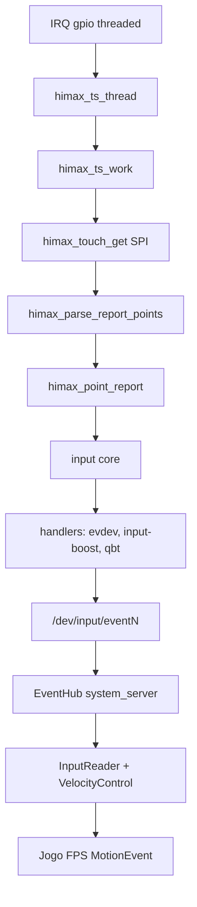
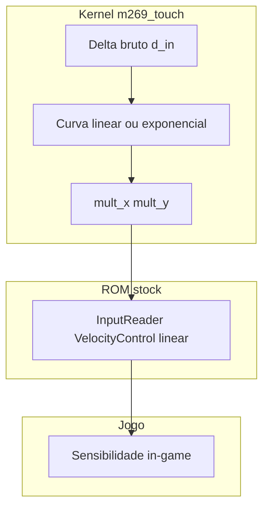
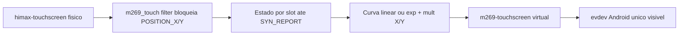

# Kernel Custom — SM-A057M (m269 / khaje / sm6225)

Documento de referência das alterações, resumo técnico e novas funcionalidades implementadas neste tree.

| Campo | Valor |
|-------|-------|
| **Dispositivo** | Samsung Galaxy A05s — SM-A057M |
| **Firmware base** | A057MUBSADYG1 |
| **Plataforma** | Qualcomm sm6225 (khaje / m269) |
| **Kernel base** | Android 15 GKI — Linux 5.15 (ThinLTO) |
| **SoC** | Snapdragon 680 4G — Kryo 265 + Adreno 610 + Spectra 346 |
| **Data do build** | 15/06/2026 (rebuild externo + repack DLKM com `camera.ko` custom concluído 21:26) |
| **Última revisão do documento** | 15/06/2026 (revisão 19 — `m269-perfd` v3, CPU freq cap, display runtime, `cam_perf_mode` e câmera custom default-off) |

### Diagnóstico geral (estado real)

```text
HOST_VALIDATED: SIM
DEPLOY FIRST + SECOND-STAGE EMPACOTADO
KERNEL_RUNTIME_VALIDATED: SIM
VENDOR_DLKM_BASE_RUNTIME_VALIDATED: SIM
RUNTIME DA REVISAO 19 PENDENTE
```

| Componente | Estado |
|------------|--------|
| Kernel GKI custom (`Image`) | **5.15.167-android13-8-31192385-abA057MUBSADYG1** — boot concluído e `sys.boot_completed=1` |
| SukiSU-Ultra | Built-in no `Image`; revisão compatível com o userspace instalado: **v4.1.0-2-gf74582a4** |
| DTB khaje | Recompilado no `dist/`; blob **stock preservado** no `vendor_boot.img` por segurança de SKU |
| `cpu_hotplug.ko` custom | Vermagic exato; limite global 0–3 corrigido; empacotado em `vendor_boot` e `vendor_dlkm`, mas a cópia carregada no teste AP ainda é stock |
| `msm_kgsl.ko` custom | `module_param_cb` 5000–50000 µs; vermagic/CRCs exatos; binário normalizado dentro do `vendor_dlkm.img` |
| `camera.ko` | **Custom default-off** dentro do `vendor_dlkm.img`; novo `cam_perf_mode` 0/1/2, comportamento stock quando `0` |
| ~285 módulos vendor | Compilados via mixed build **5.15.167** + sufixo Samsung |
| Power HAL / Camera HAL / tuning | **Stock** (ROM inalterada) |
| Perfis dinâmicos (`m269-perfd`) | **v3**: CPU hotplug + cap `scaling_max_freq`, KGSL governor/idle/max clock/bias, display runtime, câmera, diagnóstico e WebUI |
| AVB | `boot`/`vendor_boot`: chave pública stock; `vendor_dlkm`: hashtree + FEC 2 com chave custom; tamanhos stock preservados |
| Flash no aparelho | **AP corrigido iniciou com sucesso em 14/06/2026**; `sys.boot_completed=1`, release correta e KernelSU operacional |
| DLKM revisão 13 | **Falhou em runtime**: continuou congelando na primeira logo |
| DLKM revisão 14/base | EROFS sem compressão, xattrs SELinux restaurados e módulos normalizados; **runtime validado pelo usuário** |
| DLKM revisão 19 | Hotplug + KGSL + câmera custom default-off; EROFS/SELinux/AVB host validados; runtime ainda pendente após a nova câmera |

#### Revisão 19 — implementação aplicada em 15/06/2026

| Área | Implementação |
|------|---------------|
| CPU runtime | `m269-perfd` v3 escreve `policy*/scaling_max_freq` por porcentagem, preserva valores stock e restaura por `restore-stock` |
| CPU presets | Novos perfis `efficiency`, `performance` e `game`; perfis existentes mantidos |
| GPU runtime | Presets agora também controlam `mod_percent` do governor Adreno TZ quando o nó devfreq existir |
| Display runtime | Presets via `settings`/`wm size`: 60/90 Hz e render scale lógico 50–100%; não altera timing físico do painel |
| Câmera DLKM | `camera.ko` recompilado com `cam_perf_mode`: `0=stock`, `1=latência`, `2=economia`; default `0` |
| WebUI | Abas novas para Tela, Câmera e Diagnóstico; sliders para CPU cap e GPU bias |
| Deploy | `CUSTOM_VENDOR_DLKM_MODULES` default agora inclui `cpu_hotplug msm_kgsl camera` |
| Validação | `test_host_pipeline.sh` e `audit_kernel_release.sh` exigem `cam_perf_mode` e câmera custom exata no `vendor_dlkm.img` |

Hashes principais da revisão 19:

```text
boot.img:        64323de2f47b34aa96dff74afac3d1e6b9a27f62fdbd1830e42a03c038e96818
vendor_boot.img: 0d1a29e46181d11c21b6a1cf9dcfed00533581c5922e0a228c4e67a010445d04
vendor_dlkm.img: f22b240f4f93fbc588dced828073e1ef0464b08ed8041ba89b3a5af7b25b4e90
camera.ko preparado: 1d697e8e8df4fcd485a562d1f1f7c724c5f8451259dff5f2e323f870265cf7f1
msm_kgsl.ko preparado: 355f6e70cb6efa70e6448aa9f54ab2560be3f23656e62cdd3aeea0760cc32d8e
cpu_hotplug.ko preparado: a6ee97ee5c35503f3498f1d80ea5f304fb23cad587f79c49646c9d392e429e86
```

Validação host executada:

```text
./scripts/test_host_pipeline.sh: PASS
./scripts/audit_kernel_release.sh: BUILD_SAFE=SIM, PACK_SAFE=SIM
out/release/m269-perfd-kernelsu.zip: unzip -t OK
```

**Correção de diagnóstico:** havia dois incidentes diferentes. O AP antigo falhava em `ksud post-fs-data` e foi corrigido alinhando SukiSU a `f74582a4`; depois disso `boot.img` + `vendor_boot.img` iniciaram o Android e retornaram `sys.boot_completed=1`. O travamento posterior, entre aproximadamente 23:00 de 14/06/2026 e 00:10 de 15/06/2026, ocorreu somente após gravar o `vendor_dlkm.img` custom e parou na primeira logo, antes da geração de logs Android úteis.

**Primeiro defeito identificado:** o `msm_kgsl.ko` custom tinha `vermagic` correto, mas foi compilado contra uma definição incompleta de `enum dcvs_hw_type`. O firmware Samsung inclui `DCVS_L3_1 = 4`; o source usado no build pulava esse item. Com `CONFIG_MODVERSIONS`, isso alterou os CRCs esperados para quatro símbolos exportados por `qcom-dcvs.ko`. A correção eliminou essa incompatibilidade, mas o segundo teste provou que havia outro defeito no repack.

| Símbolo DCVS | CRC stock/corrigido | CRC do KGSL defeituoso |
|--------------|---------------------|-------------------------|
| `qcom_dcvs_register_voter` | `0x9ac2f748` | `0x425e7e2c` |
| `qcom_dcvs_unregister_voter` | `0x53fe6cbc` | `0x27547f87` |
| `qcom_dcvs_update_votes` | `0x374758cd` | `0xdef933ab` |
| `qcom_dcvs_hw_minmax_get` | `0x11dd5513` | `0xeb65b1b1` |

**Correção DCVS aplicada na revisão 13:** `DCVS_L3_1` foi restaurado em `include/soc/qcom/dcvs.h`, o KGSL foi recompilado e os quatro CRCs agora coincidem exatamente com o módulo stock. Essa correção era válida, porém a imagem ainda falhou porque o próprio repack EROFS estava incorreto.

#### Causa adicional confirmada após a segunda falha

| Propriedade | Stock | DLKM defeituoso | Revisão 14 |
|-------------|-------|-----------------|------------|
| Arquivos comprimidos | `0` | `263` | `0` |
| Tamanho EROFS útil | `822415360` bytes | `296988672` bytes | `791875584` bytes |
| `security.selinux` | Presente | **Ausente** | Presente |
| Contexto dos módulos | `u:object_r:vendor_file:s0` | Sem xattr | `u:object_r:vendor_file:s0` |
| Timestamp do filesystem | `1640995200` | Data do repack | `1640995200` |

O pipeline antigo usava `fsck.erofs --extract` como usuário comum, sem `--xattrs`. Uma tentativa explícita confirmou `EPERM` ao restaurar `security.selinux`. Depois, `mkfs.erofs -zlz4hc,9` criava um layout comprimido que divergia completamente do Samsung stock. A imagem era sintaticamente válida e passava no `fsck`, mas não preservava o contrato de montagem/SELinux necessário no início do Android.

**Correção da revisão 14:** um TAR PAX determinístico fornece os xattrs SELinux diretamente ao `mkfs.erofs`; o filesystem volta a ser não comprimido, com UUID, timestamp, permissões e contextos stock. Os módulos custom perdem apenas seções DWARF/BTF que não participam do runtime, reduzindo o tamanho sem alterar `vermagic`, `__versions`, símbolos ou código carregável.

**Correção anterior do AP:** SukiSU foi fixado no commit exato `f74582a4`, correspondente ao `ksud` instalado. O repack do `vendor_boot` também deixou de extrair e recriar o CPIO como usuário `1000:1000`; agora somente o payload de `lib/modules/cpu_hotplug.ko` é substituído, preservando ordem, UID/GID `0:0`, modos, timestamps e todos os demais registros stock.

#### Por que essa correção resolve o boot preso

1. O `ksud` instalado (`4.1.0-2-gf74582a4`) usa a interface antiga de sepolicy, enviando comandos no formato `cmd + arg`.
2. O kernel que travou estava em SukiSU v4.1.3, cuja interface passou a receber um bloco em lote no formato `data_len + data`.
3. As estruturas não eram compatíveis. O kernel recusou as operações com `EINVAL`; foram registradas 37 falhas consecutivas.
4. O serviço `/data/adb/ksud post-fs-data` é executado de forma síncrona pelo Android `init`. Ele entrou no script do Play Integrity Fix e não retornou.
5. Como o `post-fs-data` não terminou, o `init` não prosseguiu normalmente para o início do Zygote e da interface Android, deixando o aparelho na primeira logo.
6. O novo `Image` usa exatamente `f74582a4`, restaurando o mesmo contrato de ioctl/sepolicy esperado pelo `ksud` instalado.

Esse diagnóstico se refere ao incidente anterior do AP. O boot com o DLKM defeituoso não chegou aos logs Android; a causa foi determinada comparando binários, modversions e tipos DWARF dos módulos stock e custom.

#### Validação runtime do AP corrigido

O AP corrigido foi flasheado e iniciou o Android normalmente:

```text
sys.boot_completed: 1
uname -r: 5.15.167-android13-8-31192385-abA057MUBSADYG1
KernelSU/ksud: operacional
BOOT_COMPLETED: recebido pelo Android
```

Isso confirma em runtime a correção da incompatibilidade SukiSU e o funcionamento do `Image`. Não apareceu novamente a sequência de 37 erros `EINVAL` que bloqueava o boot anterior.

O teste também esclareceu a origem do `cpu_hotplug`: embora o módulo custom esteja dentro do `vendor_boot`, o arquivo `modules.load` desse ramdisk não contém `cpu_hotplug.ko`. O Android carregou a cópia stock de `/vendor_dlkm/lib/modules/cpu_hotplug.ko`, hash `2b2c7d84...`, enquanto o módulo normalizado da revisão 14 possui hash `a6ee97ee...`. Por isso `/sys/module/cpu_hotplug/parameters/cpu_hotplug_level` ainda não existe.

#### Correção adicional do ramdisk

O empacotador antigo extraía o CPIO stock e o recriava como usuário normal. Isso alterava UID/GID de `0:0` para `1000:1000`, além de ordem e timestamps dos registros. O novo utilitário edita diretamente o formato CPIO `newc`, substituindo apenas os bytes de `lib/modules/cpu_hotplug.ko` e seu tamanho/checksum. Um teste compara CPIO stock e custom e falha se qualquer outro conteúdo ou metadado mudar.

O flash Odin **não substitui** o `vendor_dlkm`; o conjunto custom completo exige AP Odin **+** `vendor_dlkm.img` por fastbootd ou `dd` em recovery. O DLKM ativa os módulos custom de CPU hotplug, GPU e câmera (`cam_perf_mode` default `0`, comportamento stock).

**Regra de ouro:** *compilado ≠ empacotado ≠ carregado*. Só flashear após `BUILD_SAFE: SIM` **e** `FLASH_READY: SIM` (`PACK_SAFE` + `FLASH_LAYOUT_SAFE`). `RUNTIME_VALIDATED` só após boot e módulos carregados.

### Gates de deploy / flash (quatro níveis)

| Gate | Verifica | Estado atual |
|------|----------|--------------|
| `BUILD_SAFE` | Release, vermagic, KMI básico, binários em `dist/` | **SIM** |
| `PACK_SAFE` | `vendor_boot`, `vendor_dlkm`, deps e módulos **dentro das imagens finais** | **SIM** |
| `FLASH_LAYOUT_SAFE` | Partições, slot, super, AVB, capacidade | **PENDENTE somente pela confirmação do estado de desbloqueio** |
| `KERNEL_RUNTIME_VALIDATED` | Boot completo, release do `Image` e KernelSU | **SIM** |
| `RUNTIME_VALIDATED` | Binários DLKM custom carregados, câmera, GPU e parâmetros | **NÃO** |

```text
BUILD_SAFE:          SIM
PACK_SAFE:           SIM
FLASH_LAYOUT_SAFE:   PENDENTE
KERNEL_RUNTIME_VALIDATED: SIM
RUNTIME_VALIDATED:   NÃO

FLASH_READY:         NÃO
```

`FLASH_READY` = `PACK_SAFE` + `FLASH_LAYOUT_SAFE` (não inclui runtime). O antigo rótulo `FLASH_SAFE: SIM` significava apenas **build compatível** — foi substituído por `BUILD_SAFE`.

### Gate BUILD_SAFE — kernel release / KMI (resolvido no host)

Release unificado após migração (clean build final 14/06/2026 22:51):

```text
TARGET_IMAGE_RELEASE:    5.15.167-android13-8-31192385-abA057MUBSADYG1
STOCK_REFERENCE_RELEASE: 5.15.167-android13-8-31192385-abA057MUBSADYG1
CUSTOM_MODULE_RELEASE:   5.15.167-android13-8-31192385-abA057MUBSADYG1
```

| Nível | Valor atual (auditoria host) |
|-------|------------------------------|
| `GKI_SOURCE_RELEASE` | `5.15.167` (`common/Makefile` SUBLEVEL) |
| `GKI_OUTPUT_RELEASE` | `5.15.167-android13-8-31192385-abA057MUBSADYG1` |
| `TARGET_IMAGE_RELEASE` | `5.15.167-android13-8-31192385-abA057MUBSADYG1` (`dist/Image`) |
| `STOCK_REFERENCE_RELEASE` | `5.15.167-android13-8-31192385-abA057MUBSADYG1` |
| `VENDOR_SOURCE_RELEASE` | `5.15.167` (`msm-kernel/Makefile` SUBLEVEL) |
| `VENDOR_OUTPUT_RELEASE` | `5.15.167-android13-8-31192385-abA057MUBSADYG1` |

**Diagnóstico automático** (`./scripts/audit_kernel_release.sh`):

| Caso | Significado | Estado atual |
|------|-------------|--------------|
| `CASE_VENDOR_SOURCE_TOO_OLD` | Source vendor atrás do GKI | **Resolvido** |
| `CASE_EXT_MODULE_WRONG_OUTPUT` | Módulos externos usam output incorreto | Não detectado |
| `CASE_STALE_VENDOR_OUT` | Output antigo não corresponde ao source | Não detectado |
| `CASE_TARGET_IMAGE_LOCALVERSION_MISMATCH` | Image sem release exato dos módulos stock | **Resolvido** |
| `CASE_MODULE_LOCALVERSION_MISMATCH` | `.ko` custom não corresponde ao Image alvo | **Resolvido** |
| `CASE_KMI_SYMBOL_MISMATCH` | Símbolos ou CRCs incompatíveis | Não detectado |
| `CASE_CUSTOM_FEATURE_MISSING` | KernelSU/tunables/daemon ausentes no binário final | Não detectado |
| `BUILD_SAFE` | Release + vermagic + KMI básico no host | **SIM** |

**Alinhamento de release aplicado (revisão 5 / 5b):**

Alinhar o kernel release produzido pela árvore vendor ao GKI 5.15.167, compilando os módulos como **mixed build** contra artefatos, símbolos e configuração do GKI alvo (`gki_kernel/dist`).

1. `msm-kernel/Makefile`: `SUBLEVEL` alinhado ao release do GKI alvo (123 → **167**)
2. `kernel_platform/build.config.local`: `LOCALVERSION="-31192385"`, `BUILD_NUMBER="A057MUBSADYG1"`
3. `disable_localversion_auto` no pós-defconfig (GKI + vendor)
4. `build_module.sh`: `KBUILD_MIXED_TREE` → `gki_kernel/dist` (camera/KGSL)
5. Patches mantidos: SukiSU, `cpu_hotplug_level`, KGSL `module_param_cb`

> **Nota:** alterar `SUBLEVEL` **não** implica backport automático de todos os commits Linux 5.15.124–5.15.167. A compatibilidade depende do mixed build, da KMI e dos headers/tipos consumidos pelos módulos.

**Regra central:** `MODULE_VERMAGIC == TARGET_IMAGE_RELEASE`. Para preservar módulos stock: `TARGET_IMAGE_RELEASE == STOCK_REFERENCE_RELEASE`.

Referência stock: **módulo stock** do `vendor_boot` (`cpu_hotplug.ko`). Comparação principal: **Image que será executado** (`TARGET_IMAGE_RELEASE`). `uname -r` só quando o aparelho estiver em kernel stock Samsung.

**Incorreto:** alterar só a string `5.15.167-android13-8-ab` → `…-31192385-abA057MUBSADYG1` sem migrar código, headers, configs e símbolos.

**Correto (após migração vendor + KMI):** configurar o release do `Image`, fazer módulos usarem o mesmo release, confirmar correspondência Samsung, clean build, validar símbolos/modversions.

**`BUILD_SAFE` exige (host, `dist/`):**

```text
TARGET_IMAGE_RELEASE conhecido
TARGET_IMAGE_RELEASE compatível com módulos stock preservados
todos os módulos custom usam TARGET_IMAGE_RELEASE
Module.symvers / símbolos indefinidos / module_layout (quando disponível)
CONFIG_MODVERSIONS, LTO, CFI no GKI .config
```

**`FLASH_READY` exige adicionalmente:**

```text
vendor_boot.img + vendor_dlkm.img gerados e auditados (PACK_SAFE)
flash_layout_report.txt com slot + vendor_dlkm (FLASH_LAYOUT_SAFE)
tamanhos das imagens vs partições
header v4 + deps fechados no deploy
```

```bash
./scripts/audit_kernel_release.sh   # 5 níveis + CASE_* + KMI
```

Deploy aborta sem `ALLOW_VERMAGIC_MISMATCH=1` (somente dev no host).

### Clean build diagnóstico

Script recomendado (limpa output, compila e audita; log em `build_kernel_clean.log`):

```bash
cd "/home/gullin/Downloads/Kernel A15"
./build_kernel_clean.sh
```

Equivalente manual:

```bash
rm -rf out/kernel-m269-thinlto "../Kernel-A15-build/out/kernel-m269-thinlto"
SKIP_MRPROPER=0 FAST_BUILD=0 JOBS=8 ./build_kernel_thinlto.sh
./scripts/audit_kernel_release.sh
```

| Resultado pós-clean | Diagnóstico |
|---------------------|-------------|
| Módulos continuam 5.15.123 | `CASE_VENDOR_SOURCE_TOO_OLD` — source msm-kernel realmente antigo |
| Módulos passam a 5.15.167 | Era `CASE_STALE_VENDOR_OUT` |
| Vendor 5.15.167, externos 5.15.123 | `CASE_EXT_MODULE_WRONG_OUTPUT` — mirror/`O=` do `build_ext_modules.sh` |
| Release Image sem sufixo Samsung | `CASE_TARGET_IMAGE_LOCALVERSION_MISMATCH` |
| Módulo custom diverge do Image alvo | `CASE_MODULE_LOCALVERSION_MISMATCH` |
| Release igual, símbolos falham | `CASE_KMI_SYMBOL_MISMATCH` |

> **Último clean build (14/06/2026 22:51):** `BUILD_SAFE: SIM` — ver `logs/build_kernel_fixed-20260614.log`.

### `audit_kernel_release.sh` — o que verifica

| Saída | Origem |
|-------|--------|
| `GKI_SOURCE_RELEASE` | `kernel_platform/common/Makefile` |
| `GKI_OUTPUT_RELEASE` | `gki_kernel/.../include/config/kernel.release` |
| `IMAGE_OUTPUT_RELEASE` | `strings dist/Image` |
| `TARGET_IMAGE_RELEASE` | `dist/Image` (fallback: `GKI_OUTPUT_RELEASE`) |
| `STOCK_REFERENCE_RELEASE` | vermagic `cpu_hotplug.ko` stock / `uname -r` |
| `VENDOR_SOURCE_RELEASE` | `kernel_platform/msm-kernel/Makefile` |
| `VENDOR_OUTPUT_RELEASE` | `msm-kernel/.../include/config/kernel.release` |
| `MODULE_VERMAGIC` | `modinfo` dos `.ko` custom vs `TARGET_IMAGE_RELEASE` |
| `RUNNING_DEVICE_RELEASE` | `adb shell uname -r` (se online) |
| `STOCK_MODULE_VERMAGIC` | `cpu_hotplug.ko` do `vendor_boot` stock (host) |
| `CASE_*` | Classificação automática da causa |
| KMI básico | `llvm-nm -u` vs GKI `Module.symvers`; `modprobe --dump-modversions` (`module_layout`); `CONFIG_MODVERSIONS`, `LTO_CLANG`, `CFI_CLANG` |
| Gates | `BUILD_SAFE`, `PACK_SAFE`, `FLASH_LAYOUT_SAFE`, `RUNTIME_VALIDATED`, `FLASH_READY` |

Biblioteca: `scripts/lib/kernel_release_audit.sh` (usada por audit, deploy e `audit_host_modules.sh`).

### Alinhamento vendor release (concluído — revisão 5)

O zip Samsung oficial traz `msm-kernel` com `SUBLEVEL=123` (GKI misto normal). O alinhamento do **release produzido** com `A057MUBSADYG1` exigiu:

| Alteração | Arquivo |
|-----------|---------|
| SUBLEVEL 123 → 167 | `kernel_platform/msm-kernel/Makefile` |
| Sufixo Samsung | `build.config.local` (`LOCALVERSION`, `BUILD_NUMBER`) |
| Sem `LOCALVERSION_AUTO` | `disable_localversion_auto` em `build.config.local` |
| KBUILD_MIXED_TREE correto | `build/kernel/build_module.sh` → `gki_kernel/dist` |

Resultado validado: `./scripts/audit_kernel_release.sh` → **BUILD_SAFE: SIM**.

### Classificação de módulos (inferência vs confirmação)

| Módulo | Classificação atual |
|--------|---------------------|
| `cpu_hotplug.ko` | `DUPLICATED` — presente em `vendor_boot` e `vendor_dlkm`; no aparelho ele é efetivamente carregado pelo `vendor_dlkm` |
| `msm_kgsl.ko` | `SECOND_STAGE_VENDOR_DLKM_CONFIRMED` |
| `camera.ko` | `SECOND_STAGE_VENDOR_DLKM_CONFIRMED` |

Com o `vendor_dlkm.img` extraído, KGSL e câmera foram confirmados como `SECOND_STAGE_VENDOR_DLKM_CONFIRMED`.

### Veredito (revisão 5b)

| Aspecto | Estado |
|---------|--------|
| Release unificado | **SIM** |
| KGSL recompilado | **SIM** |
| Módulos externos no GKI certo | **SIM** |
| KMI básica (host) | **SIM**; CRC completo não confirmado |
| Build reproduzível limpo | **SIM** |
| `boot.img` build-compatible | **SIM** |
| `boot.img` flash-ready | Pendente somente layout/bootloader |
| `vendor_dlkm` elegível para geração | **SIM** |
| `vendor_dlkm` gerado e auditado | **SIM** — EROFS, hashtree, FEC 2, tamanho stock |
| Layout / AVB | `/dev/block/dm-6`, `835686400` bytes e capacidade **SIM**; propriedades Android reportam bootloader/AVB `locked/green`, portanto desbloqueio fica **não confirmado** |
| Runtime | **PENDENTE** |

```text
BUILD_SAFE:                    SIM
PACK_SAFE:                     SIM
FLASH_LAYOUT_SAFE:             PENDENTE
RUNTIME_VALIDATED:             NÃO
FLASH_READY:                   NÃO
```

**Sequência recomendada (Etapa A → D):**

```bash
# A — descobrir layout e extrair stock (sem modificar aparelho além de pull opcional)
./scripts/audit_kernel_release.sh
./scripts/discover_flash_layout.sh
./extract_stock_images.sh
./scripts/audit_host_modules.sh

# B — gerar imagens finais
PULL=1 ./scripts/deploy_kernel_modules.sh
./scripts/audit_kernel_release.sh   # audita módulos DENTRO das imagens (PACK_SAFE)

# C — confirmar tamanhos, AVB, header v4 no relatório deploy

# D — flash incremental (custom completo):
#     1) Odin4: AP_KERNEL_CUSTOM.img.tar  (boot + vendor_boot)
#     2) Recovery: flash_via_dd.sh só para vendor_dlkm (ou as 3 partições)
#     3) m269-perfd-kernelsu.zip pelo SukiSU Manager
#     NÃO considerar completo só o passo Odin.
./scripts/validate_modules_adb.sh
```

---

## Arquitetura técnica do projeto

### Origem e escopo do repositório

O pacote opensource da Samsung para o A05s (Android 15) é entregue em **dois blocos** complementares, não em um AOSP completo:

| Bloco | Conteúdo típico | Papel |
|-------|-----------------|-------|
| **Kernel** | Árvore do kernel GKI + overlay Qualcomm/Samsung (m269), toolchain, device trees, scripts de build do kernel | Tudo que roda em **modo privilegiado (ring 0)** — scheduler, drivers, memória, root embutido |
| **Platform** | Bibliotecas Samsung, frameworks parciais, módulos que exigem o build system Android (`Android.bp` / Soong) | Componentes de **userspace** que normalmente são empacotados na ROM (não no boot.img) |

Este workspace combina ambos, mas o **pipeline customizado implementado aqui compila apenas o kernel e módulos relacionados**. A ROM (system, vendor, product), os serviços HAL em `.so` e os APKs Samsung **permanecem os do firmware instalado no aparelho** — só as partições de boot são substituídas.

---

### Camadas do Android no dispositivo

Do hardware até o aplicativo, a pilha relevante para entender o que foi (e não foi) alterado:

```
┌─────────────────────────────────────────────────────────────┐
│  Apps / Samsung One UI / Camera App / Games                 │
├─────────────────────────────────────────────────────────────┤
│  Android Framework (CameraService, PowerManager, SurfaceFlinger) │
├─────────────────────────────────────────────────────────────┤
│  HAL (Hardware Abstraction Layer) — .so em /vendor           │
│  camera HAL, audio HAL, display composer, sensors, GPS…      │
├─────────────────────────────────────────────────────────────┤
│  Kernel userspace helpers (libdmabuf, ion, perf HAL ioctl)   │
├─────────────────────────────────────────────────────────────┤
│  Módulos do kernel (.ko) — vendor_dlkm / system_dlkm         │
│  camera.ko, msm_kgsl.ko, wlan, fingerprint, sec_debug…     │
├─────────────────────────────────────────────────────────────┤
│  Kernel GKI (Image) — monolito + built-in + hooks (KSU)     │
│  Linux 5.15, scheduler, MM, SELinux, syscall table           │
├─────────────────────────────────────────────────────────────┤
│  Device Tree (DTB/DTBO) — pinagem, clocks, regulators khaje  │
├─────────────────────────────────────────────────────────────┤
│  SoC sm6225 — Kryo 265, Adreno 610, ISP Spectra 346, I/O    │
└─────────────────────────────────────────────────────────────┘
```

**Regra prática:** o que está **acima** do kernel só muda se você recompilar e reflashear `system`, `vendor` ou `product`. O trabalho atual atua na **base da pilha** (Image + DTB + eventualmente DLKMs).

---

### O que é o kernel neste projeto

O kernel Android 15 neste chipset usa o modelo **GKI misto (Generic Kernel Image)**:

#### Kernel GKI (common)

- Base **Linux 5.15** mantida pelo Android Common Kernel (ACK).
- Compilado como imagem única (`Image`) com ABI **KMI** (Kernel Module Interface) estável.
- Contém o núcleo do SO: syscalls, VFS, rede, memória, SELinux, cgroup, binder, etc.
- No build misto, **só o GKI gera o `Image` e o `vmlinux`** — é aqui que o código executável do kernel realmente reside.

**Implementado no GKI:**
- **SukiSU-Ultra v4.1.0-2-gf74582a4** compilado como built-in (`CONFIG_KSU=y`, `CONFIG_KPM=y`), alinhado ao `ksud` instalado.
- Hooks em LSM/syscall, gerenciamento de root via supercall, perfis de apps, integração com `ksud`.
- KMI strict mode relaxado localmente para permitir símbolos extras do KernelSU.

#### Kernel vendor (msm-kernel / overlay m269)

- Extensão Samsung/Qualcomm sobre o GKI: defconfigs `m269`, drivers out-of-tree, DTBs **khaje**.
- No modo misto, **não relinka o `Image`** — compila **módulos** (`.ko`) e **device trees** (`.dtb`/`.dtbo`).
- Inclui drivers Samsung (`sec_*`), Qualcomm (RPM, SPMI, display clock, thermal), e a árvore de pinagem do A05s.

**Implementado no vendor:**
- Fragmento de config com `CONFIG_KSU` (consistência; o root efetivo está no GKI).
- Parâmetro `cpu_hotplug_level` como limite global de CPUs mantidas offline (0–3), preservando cada cooling device como binário.
- ~285 módulos `.ko` **compilados** no host; `cpu_hotplug`, KGSL e câmera custom foram empacotados, enquanto os demais módulos stock do `vendor_dlkm` foram preservados.

#### Device Tree (khaje)

- Descreve **hardware fixo** do sm6225 no SKU A05s: CPUs, GPU, câmera, DSI, touch, PMIC, memória.
- **DTB principal** identifica a variante `khaje`; **DTBOs** representam diferentes SKUs ou revisões de hardware khaje (confirmar cada overlay com `dtc -I dtb -O dts` + diff, sem assumir RAM/display/USB-C por nome).
- O build gera os DTBs para auditoria, mas o `vendor_boot.img` final preserva o blob DTB stock por padrão. `DTB_MODE=custom` é somente para validação explícita de SKU.

---

### O que é o vendor neste projeto

No contexto Android, **vendor** tem dois significados — ambos presentes no tree:

#### 1. Partição `vendor` (no telefone)

- Imagem ext4/erofs com bibliotecas HAL (`.so`), firmware, configs, overlays RRO.
- **Não foi recompilada** neste trabalho. Após flash do kernel, o `/vendor` do firmware A057MUBSADYG1 continua o mesmo.

#### 2. Árvore `vendor/` (no source)

Código proprietário/OSS da Qualcomm e Samsung usado para **compilar componentes** que vão para a ROM ou para DLKM:

| Domínio | O que contém (conceitual) | Compilado neste build? |
|---------|---------------------------|------------------------|
| **Módulos kernel Qualcomm** | Câmera (ISP, sensores, CPAS), GPU (KGSL/Adreno 610), áudio-kernel, display-drivers, touch, WLAN, securemsm, mm-drivers, data-kernel | **Parcial** — `cpu_hotplug.ko`, `camera.ko` e `msm_kgsl.ko` compilados; deploy via `deploy_kernel_modules.sh` |
| **Interfaces HIDL/AIDL** | Definições de interface entre framework e HAL (display composer, allocator, bluetooth_audio, etc.) | Não — exigem build Soong completo |
| **Audio HAL / PAL / AGM** | Camada de áudio Qualcomm entre framework e driver | Não |
| **Samsung frameworks** | Extensões de câmera, libs proprietárias | Não — pertencem ao tarball Platform |
| **Thermal / power userspace** | `thermal-engine`, políticas de throttling em userspace | Não |

O vendor source é essencial como **fonte dos drivers kernel** que conversam diretamente com o hardware. Os HALs em userspace consomem esses drivers via ioctl, sysfs, configfs e shared buffers (ION/dmabuf).

---

### O que é o HAL neste projeto

O **HAL (Hardware Abstraction Layer)** é a fronteira entre o framework Android e o hardware, implementada em **userspace** (bibliotecas `.so` em `/vendor/lib64/hw/` ou serviços binderizados).

| Aspecto | Detalhe |
|---------|---------|
| **Função** | Traduz APIs Android (ex.: `camera3_device_ops_t`) em operações no driver kernel |
| **Tecnologia** | HIDL (legado) e AIDL (Android 13+) — stubs gerados a partir de interfaces `.hal`/`.aidl` |
| **Dependência do kernel** | HAL assume versão de driver, IOCTLs e símbolos exportados (`Module.symvers`) compatíveis |
| **Neste repo** | Interfaces e implementações HAL estão no tree Platform/vendor, mas **não entram no `build_kernel_thinlto.sh`** |

**Implicação para câmera:** o **Camera HAL** do firmware stock fala com `camera.ko` via V4L2/CRM. Se o módulo kernel for atualizado sem atualizar o HAL (ou vice-versa), pode haver incompatibilidade de ABI. Por isso o build compila `camera.ko` contra o mesmo `Module.symvers` do kernel gerado — mas o HAL em si permanece o da ROM stock.

---

### O que mais existe no tree (não compilado pelo pipeline custom)

| Área | Conteúdo | Status |
|------|----------|--------|
| **system** | Programas BPF e utilitários de sistema | Presente; build via `build_64bit.sh` + AOSP completo |
| **art** | Android Runtime (ART/Dalvik) | Presente; não usado no build de kernel |
| **external** | Dependências externas (libs, tools) | Presente; suporte a builds Android completos |
| **libcore** | Bibliotecas Java core | Presente; não usado no build de kernel |

Estes blocos existem porque o tarball Platform da Samsung assume integração futura num tree AOSP 15 completo. O fluxo custom focado em kernel **ignora** essa etapa.

---

### Pipeline de build técnico

O build custom segue esta sequência lógica:

```
1. Integração SukiSU
   └─ Checkout do commit f74582a4 → symlink do driver no GKI → patch em Kconfig/Makefile

2. Preparação do ambiente
   └─ Rsync da árvore kernel para path sem espaços (evita quebra de Make)
   └─ Instalação dos device trees Qualcomm (proprietary DT) no overlay khaje
   └─ Toolchain Clang r450784e (Android 14/15 prebuilt)

3. Build misto GKI (build.sh)
   ├─ Fase A — GKI (common)
   │    ├─ gki_defconfig + enable_gki_ksu_config (CONFIG_KSU, CONFIG_KPM)
   │    ├─ ThinLTO (LTO=thin) — otimização interprocedural leve
   │    ├─ Compila Image, vmlinux, modules.builtin, vmlinux.symvers
   │    └─ Saída: gki_kernel/dist/
   │
   └─ Fase B — Vendor (msm-kernel)
        ├─ Merge defconfig: m269 + sec + ksu_susfs + GKI.config
        ├─ KBUILD_MIXED_TREE aponta para artefatos GKI (símbolos pré-exportados)
        ├─ Compila APENAS modules + dtbs (não relinka Image)
        ├─ Gera initramfs com módulos vendor (~285 .ko)
        └─ Saída: msm-kernel out + dist/

4. Módulos externos (EXT_MODULES)
   └─ camera-kernel → camera.ko (stack CRM/ISP/sensor)
   └─ graphics-kernel → msm_kgsl.ko (KGSL Adreno 610 + parâmetros runtime)
   └─ Linkados contra o msm-kernel out + KBUILD_MIXED_TREE

5. Empacotamento flash (boot)
   └─ boot.img: header stock + Image custom + ramdisk stock
   └─ vendor_boot.img: vendor ramdisk stock + dtb.img (khaje.dtb)
   └─ init_boot.img: cópia stock (header v4 / GKI signing)

6. Deploy módulos (manual — bloqueado se vermagic divergir)
   └─ audit_kernel_release.sh → BUILD_SAFE / PACK_SAFE / FLASH_READY (obrigatório)
   └─ audit_host_modules.sh → classificação CONFIRMED / EXPECTED
   └─ deploy_kernel_modules.sh → vendor_boot + vendor_dlkm + header audit + deps
   └─ discover_flash_layout.sh → layout Samsung antes do flash
   └─ validate_modules_adb.sh → partição / carregado / srcversion / parâmetro
```

#### Parâmetros de build relevantes

| Parâmetro | Valor | Efeito |
|-----------|-------|--------|
| `LTO=thin` | ThinLTO | Kernel menor e mais rápido; link mais demorado |
| `FAST_BUILD=1` | Ativo | Pula etapas não essenciais do build.sh |
| `SKIP_MRPROPER=1` | Ativo | Build incremental entre execuções |
| `TARGET_BUILD_VARIANT=user` | user | Defconfig de produção (sem debug extra) |
| `BOOT_IMAGE_HEADER_VERSION=4` | v4 | Layout moderno: boot + vendor_boot + init_boot |
| `KMI_SYMBOL_LIST_STRICT_MODE=0` | Relaxado | Permite KernelSU sem falha de certificação ABI |

#### Modelo de módulos (DLKM)

Android 13+ no GKI separa módulos em partições:

| Partição | Conteúdo típico no A05s |
|----------|-------------------------|
| **system_dlkm** | Módulos GKI assinados (lista `gki_system_dlkm_modules`) |
| **vendor_dlkm** | Módulos OEM (câmera, display, audio, touch, Samsung sec_*) |
| **initramfs** (em boot) | Módulos carregados cedo no boot (lista do msm-kernel) |

O pack básico de boot **não reconstrói** `vendor_dlkm`; essa etapa é feita por `scripts/deploy_kernel_modules.sh` (requer `erofs-utils` no host: `fsck.erofs`, `mkfs.erofs`). O deploy completo já foi executado nesta release.

---

### Partições de boot e o que cada uma carrega

| Partição | Header | Conteúdo após flash custom |
|----------|--------|----------------------------|
| **boot** | v4 | **Kernel GKI custom** (com KernelSU) + ramdisk principal stock + bootconfig |
| **vendor_boot** | v4 | Ramdisk vendor + **DTB stock khaje**; contém `cpu_hotplug.ko` custom, mas não o lista em `modules.load` |
| **init_boot** | v4 | Cópia stock — **recuperação**; não reflashear em atualização normal |
| **vendor_dlkm** | — | Origem efetiva de `cpu_hotplug`, `msm_kgsl`, `camera` e `msm_drm`; gerado por `deploy_kernel_modules.sh` |

O endereço de carga do kernel (`0x80000000`), page size (`4096`) e base do device tree seguem os parâmetros Samsung m269 — extraídos do header das imagens stock para garantir compatibilidade com o bootloader do aparelho.

---

### O que foi implementado vs. o que permanece stock

| Camada | Stock (firmware A057M) | Custom implementado |
|--------|------------------------|---------------------|
| **Image / vmlinux** | GKI/vendor release Samsung 5.15.167 com sufixo do firmware, sem KernelSU | GKI **5.15.167-android13-8-31192385-abA057MUBSADYG1** + **SukiSU-Ultra f74582a4** + KPM; **runtime validado** |
| **Device Tree** | khaje do firmware | DTBs recompilados disponíveis; blob stock preservado na imagem flash por segurança |
| **Módulos vendor (285 .ko)** | Versão stock | Recompilados **5.15.167** + sufixo Samsung; vermagic alinhado |
| **msm_kgsl.ko** | Stock em `vendor_dlkm` | Compilado e empacotado no DLKM custom com CRCs DCVS compatíveis; runtime pendente |
| **camera.ko** | Custom em `vendor_dlkm` | Recompilado no `dist/` e empacotado; `cam_perf_mode` default `0` preserva comportamento stock |
| **msm_drm.ko** | Stock em `vendor_dlkm` | Stock na imagem final; source disponível — custom com tunables display **planejado**, não implementado |
| **cpu_hotplug.ko** | Stock no ramdisk `vendor_boot` | **Compilado e injetado** no `vendor_boot.img` final |
| **CPU thermal hotplug** | Cooling devices binários | `cpu_hotplug_level` limita globalmente 0–3 CPUs offline; runtime pendente do `vendor_dlkm` custom |
| **GPU governor** | 10000 µs (10 ms) | **Stock no build** + tunável via `governor_call_interval_us` (5000–50000 µs) |
| **GPU idle timer** | 80 ms | **Stock no build** + tunável via sysfs `idle_timer` |
| **m269-perfd** | N/A | **Novo** — shell Android, auto start via módulo KernelSU, restaura governor/idle/hotplug/max GPU |
| **HAL / framework / ROM** | One UI completa | **Inalterados** |
| **susfs (hide)** | `fs/susfs.c` + hooks GKI | **Integrado (rev. 19)** — susfs4ksu patches no `common/`; SukiSU `f74582a4` inalterado; rebuild pendente |

---

### Fluxo técnico: exemplo câmera e GPU

**Câmera (capture de foto):**
1. App Camera → CameraService (framework)
2. Camera HAL vendor (`android.hardware.camera.provider`) recebe request
3. HAL ioctl/open em nodes criados por `camera.ko` (cam_req_mgr, ISP, sensor)
4. Driver kernel programa CPAS/CSID/IFE no sm6225
5. Buffer de imagem via ION/dmabuf → SurfaceFlinger → app

**GPU (renderização / jogo):**
1. App → GLES/Vulkan → SurfaceFlinger
2. Composer HAL → `/dev/kgsl-3d0` (criado por `msm_kgsl.ko`)
3. KGSL agenda comandos na **Adreno 610** do sm6225 (Snapdragon 680)
4. Governor devfreq (`kgsl_pwrscale`) ajusta frequência — janela mínima em **µs** (`governor_call_interval_us`)
5. Após inatividade, `idle_timer` (**ms**) controla entrada em slumber (valores maiores = GPU ativa por mais tempo)

Os tunables de CPU/GPU atuam nas etapas 4–5 (kernel ou daemon root). HAL e framework não foram modificados. O módulo `camera.ko` afeta **estabilidade e latência** do pipeline kernel; qualidade visual (HDR, cores, night mode) permanece no HAL/tuning Samsung.

---

### Estudo: limites de câmera e display — HAL vs vendor_dlkm

**Data do estudo:** 15/06/2026  
**Escopo documentado:** análise técnica e roadmap de implementação **kernel/DLKM only** — sem alteração da partição `/vendor` nem dos APEX Samsung.  
**Documento complementar:** `New_Features_for_add.md` (CPU/GPU OC/UV, resolução, priorização geral).

#### Esclarecimento: o HAL Samsung NÃO está no vendor_dlkm

`vendor_dlkm.img` contém **somente módulos kernel** (`.ko`). O HAL é userspace e vive na ROM stock (`/vendor` + APEX), **não** no DLKM.

```
App Camera / SurfaceFlinger
        ↓
Samsung unihal APEX  (/vendor/apex/com.samsung.android.camera.unihal.signed.apex)
        ↓
Camera Provider      (/vendor/bin/hw/android.hardware.camera.provider@2.4-service_64)
Composer HAL / HWC   (/vendor/lib64/…)
        ↓
camera.ko / msm_drm.ko  (vendor_dlkm — drivers kernel)
        ↓
Spectra 346 ISP/TFE/OPE  |  SDE + painel DSI (hx83112f)
```

| Componente | Caminho no aparelho | No `vendor_dlkm`? | Modificável no escopo kernel-only? |
|------------|---------------------|-------------------|-------------------------------------|
| Driver câmera (`camera.ko`) | `/vendor_dlkm/lib/modules/camera.ko` | **Sim** (custom default-off) | **Sim** — compila e é empacotado em `out/flash/vendor_dlkm.img` |
| Driver display (`msm_drm.ko`) | `/vendor_dlkm/lib/modules/msm_drm.ko` | **Sim** (stock hoje) | **Sim** — source em `vendor/qcom/opensource/display-drivers/` |
| Samsung Camera HAL (HDR, night, tuning) | `/apex/com.samsung.android.camera.unihal/` | **Não** | **Não** (exige ROM/APEX) |
| Camera Provider Qualcomm (CHI/CRM) | `/vendor/bin/hw/` + `.so` | **Não** | **Não** |
| Configs de painel (timings, modos DRM) | `/vendor/etc/` ou firmware panel | **Não** | **Não** |
| Partição `/vendor` inteira | EROFS/ext4 da ROM | **Não** | **Não** — pipeline custom não a recompila |

**Evidência runtime (logs):** no boot, `apexd` monta `com.samsung.android.camera.unihal.signed.apex` em `/apex/com.samsung.android.camera.unihal@…`; o serviço `android.hardware.camera.provider@2.4-service_64` inicia de `/vendor/bin/hw/`. Nenhum desses artefatos está dentro do `vendor_dlkm.img`.

**Mudança da revisão 19:** `camera.ko` deixou de ser stock no deploy porque agora possui funcionalidade runtime real e default-off. `CUSTOM_VENDOR_DLKM_MODULES` default = `cpu_hotplug msm_kgsl camera`; o HAL stock permanece inalterado e o novo módulo preserva ABI de ioctl, alterando apenas votos internos de clock quando `cam_perf_mode` é diferente de `0`.

**Por que não “modificar o HAL” trocando o DLKM?** O flash custom substitui `boot`, `vendor_boot` e `vendor_dlkm`. A partição **`/vendor` da ROM A057MUBSADYG1 permanece intacta**. Trocar `camera.ko` altera a camada **abaixo** do HAL; o unihal Samsung continua montando pipelines, AWB, MFNR e night mode em userspace. Melhorias visuais (HDR, night, portrait) exigiriam reempacotar o APEX unihal ou a partição `vendor` — fora do escopo kernel-only adotado neste roadmap.

#### Limites reais — Câmera (Spectra 346 / arquitetura holi)

**Config de build:** `vendor/qcom/opensource/camera-kernel/config/holi.mk` — `CONFIG_SPECTRA_ISP`, `OPE`, `TFE`, `SENSOR` ativos para khaje/bengal/holi.

**Ausente** em relação a SoCs maiores (lahaina, yupik, kona): ICP, JPEG HW dedicado, LRME, face detection HW (`CONFIG_SPECTRA_FD`).

**Pipeline kernel:** `cam_req_mgr` → CPAS (clock/BW) → TFE CSID → TFE → OPE → sensor CCI.

| Recurso | Limite no driver (headers) | Limite prático no A05s |
|---------|---------------------------|------------------------|
| Instâncias TFE CSID | `CAM_TFE_CSID_HW_NUM_MAX` = 7 (genérico) | sm6225 usa subconjunto real (1–2 pipes) |
| Contextos IFE/TFE | `CAM_IFE_CTX_MAX` = 8 | HAL stock define preview + snapshot + vídeo |
| Saídas ISP | `CAM_ISP_IFE_OUT_RES_*` (full, DS4, stats, PDAF, RDI…) | **Sem FD HW** nesta plataforma |
| BW CPAS | `cam_cpas_util_vote_bus_client_bw()` | Mínimos `CAM_CPAS_AXI_MIN_*` — tunável no driver |
| Qualidade visual | — | **HAL Samsung** (AWB, MFNR, scene) — fora do kernel |

**O que o kernel PODE melhorar (sem HAL):**

1. **Latência** — sustain de clock CPAS, BW AXI menos conservador em preview.
2. **Estabilidade de FPS** — reduzir jitter de submit no `cam_req_mgr`.
3. **Eficiência** — power gating CAMSS (`gcc_camss_top_gdsc` em `khaje.dtsi`) mais agressivo em idle.
4. **Perfis runtime** — ex.: `cam_perf_mode={balance,latency,power}` via `module_param`.
5. **Diagnóstico** — debugfs de latência de pipeline para WebUI/m269-perfd.

**O que o kernel sozinho NÃO desbloqueia:**

- Night mode, HDR+, AI scene, portrait bokeh, 4K60, slow-mo — tuning no **unihal APEX**.
- Resolução máxima / binning — negociação sensor + HAL.
- Novos algoritmos MFNR visíveis — OPE existe, mas pipelines são montados pelo CHI/HAL (`ChiAWBAlgorithmEntry` no provider Qualcomm, logs runtime).

#### Limites reais — Display (SDE bengal / khaje)

**Stack:** `msm_drm.ko` (stock no DLKM) — config `vendor/qcom/opensource/display-drivers/config/gki_bengaldisp.conf`: SDE + DSI; sem DP; `CONFIG_DRM_SDE_RSC=n` (sem always-on display kernel).

| Item | Detalhe |
|------|---------|
| Painel físico (stock) | DSI **720×1600 ~90 Hz** — DTBO `khaje-idps-display-90hz` |
| Touch | `hx83112f.ko` — `softdep pre: msm_drm` em `modules.softdep` |
| SDE scaler | QSEED3/QSEED3LITE — `sde_hw_ds.c`; `SDE_MAX_IMG_WIDTH/HEIGHT` = 0x3FFF |
| Clock display | `dispcc-khaje.ko` no DLKM |

| Feature | Viabilidade kernel-only | Notas |
|---------|------------------------|-------|
| Refresh **90 ↔ 60 Hz** dinâmico | **Alta** | Se modos DRM já registrados pelo panel driver stock |
| **Render scale** 75%/50% (SDE) | **Alta** | Menos pixels → GPU/DDR/bateria; painel físico continua 720×1600 |
| Resolução panel nativa alternativa | **Baixa** | Timings em `/vendor` — fora do escopo kernel-only |
| HDR / wide color | **Baixa** | HAL + painel + certificação |
| Always-on display (RSC) | **Média-baixa** | `CONFIG_DRM_SDE_RSC=n` no build atual |

**Risco display:** mode-set via kernel sem coordenar HWC pode causar flicker — validar modos com `dumpsys SurfaceFlinger` antes de expor sysfs de refresh; fallback seguro = render scale sem alterar timing do painel.

#### wm size, wm density e jogos — vs render scale kernel

`wm size` e `wm density` **não são kernel** — são overrides do **WindowManager** via `DisplayManagerService` (userspace). O pipeline afetado:

```
wm size WxH  /  wm density N
        ↓
DisplayManagerService (logicalWidth, logicalHeight, densityDpi)
        ↓
DisplayMetrics → apps e jogos leem width/height/density
        ↓
SurfaceFlinger → GPU (Adreno 610) → SDE (msm_drm) → painel físico 720×1600
```

| Comando | O que altera | Efeito em jogos |
|---------|--------------|-----------------|
| `adb shell wm size WxH` | `logicalWidth` / `logicalHeight` reportados ao sistema | Jogo aloca superfície e calcula sensibilidade com base nesses pixels |
| `adb shell wm density N` | `densityDpi` (escala dp/sp) | UI maior/menor em dp; engines que misturam dp com px podem sentir mudança de **escala** sem alterar pixels de render da mesma forma |
| `wm size reset` / `wm density reset` | Remove override | Volta ao stock |

**Sensibilidade e escala (mecânica do touch):**

- Jogos mapeiam aim/rotação a `delta_toque / largura_lógica_em_pixels`.
- O mesmo movimento físico do dedo percorre uma **fração diferente** da tela lógica quando a resolução reportada muda — daí o efeito de sensibilidade ou escala percebida.
- Comunidade mobile (threads XDA de FPS/gaming): truque comum é **reduzir** `wm size` abaixo do nativo (ex. `960×540` em painel `720×1600`) para ganhar FPS e sensibilidade relativa maior.
- **Aumentar** `wm size` acima do nativo: `DisplayMetrics` reporta valores maiores → jogos podem recalcular FOV/sensibilidade; o compositor faz **downscale** para caber no painel físico → GPU frequentemente **piora** (mais render + scale), não melhora — salvo engines que limitavam resolução internamente.
- `wm density` sozinho **não reduz** pixels de render na maioria dos jogos 3D, mas altera percepção de escala em UI e em engines sensíveis a dp.

**Problemas do override global `wm size`:**

- Afeta **todo o sistema** (launcher, notificações, gestos Samsung).
- Requer `adb`/root; não persiste entre reboots sem script.
- Pode quebrar aspect ratio, teclado e navegação One UI.
- Economia de GPU **nem sempre proporcional** — depende do jogo, do HWC e de buffers do compositor.

**Comparação: `wm size` vs `display_render_scale_pct` (kernel SDE, planejado):**

| Aspecto | `wm size` (WM) | `display_render_scale_pct` (kernel) |
|---------|----------------|-------------------------------------|
| Onde atua | DisplayManager / métricas lógicas | Pipeline SDE (`vendor/qcom/opensource/display-drivers/msm/sde/sde_hw_ds.c`) |
| Poupa GPU? | **Às vezes** — se apps renderizam menos pixels | **Parcial** — poupa SDE/DDR; GPU só poupa se framebuffer de entrada também for menor |
| Sensibilidade | Altera coordenadas lógicas que o jogo lê | **Não altera automaticamente** o touch — exige ajuste coordenado |
| Escopo | Global, invasivo | Preset **gaming** via m269-perfd (não afeta launcher se bem isolado) |
| Painel físico | Inalterado | Inalterado (`720×1600`); upscale SDE |

**Resposta à hipótese (jogos + sensibilidade + GPU):**

- **Parcialmente correta:** reduzir pixels renderizados poupa GPU e aproxima o ganho de FPS de um `wm size` menor.
- **Não é equivalente 1:1** à sensibilidade do `wm size` sem também ajustar o espaço de coordenadas de input ou a métrica que o jogo lê.
- **Preset documentado como ideal — GamingDisplay (tríade):** (1) `display_render_scale_pct` (ex. 75%) + cap GPU (`max_gpuclk` economy) + refresh 60 Hz; (2) `m269_touch` com `touch_mult_y` > `touch_mult_x` para FPS; (3) curva exponencial opcional em vez da aceleração linear do InputReader.

#### Comportamento completo do touch (hx83112f)

**Escopo desta seção:** descrever em detalhe como o touch funciona no SM-A057M — do hardware HiMax até o que o jogo FPS lê — para fundamentar a implementação futura do `m269_touch.ko`. **Nada abaixo está implementado** no build atual.

##### Hardware e seleção de driver (runtime SM-A057M)

**Evidência:** logs `ksu-dmesg-old.log`, `logs/failed-boot-20260614/last_kmsg` — o IC ativo é **HiMax HX83112F TXD**, não Synaptics nem ilitek do DT de referência.

| Item | Valor |
|------|-------|
| IC ativo | **HiMax hx83112f** (vendor TXD), FW `hx83112f_TXD_FW.bin` |
| Bus | **SPI** (`spi0.2`) |
| Input device name | `"himax-touchscreen"` (`himax_platform.c`) |
| Módulo DLKM | `hx83112f.ko` — deps: `lct_tp.ko`, `tp_info.ko`, `cmd.ko`, `msm_drm.ko`, `panel_event_notifier.ko` |
| Painel acoplado | `qcom,mdss_dsi_hx83112f_txd_fhd_90hz_video` (bootconfig/cmdline) |
| Seleção SKU | DT `tpsensor = "HIMAX_TXD_HX83112F"` — `himax_platform.c` ~L1502; outros valores carregam BOE ou falham |
| Coordenadas exemplo | `[HXTP] S1@591, 2399` — espaço lógico do controller |
| Info proc | `tp_info.ko` → `/proc/tp_info` — `[Vendor]TXD,[FW]0x07,[IC]hx83112f` |
| Softdep | `MODULE_SOFTDEP("pre: msm_drm")` — display deve carregar antes do touch |
| Ordem `modules.load` | `tp_info` → `lct_tp` → `cmd` → … → `msm_drm` → `hx83112f` |

O DT `khaje-idp.dtsi` lista **ilitek** e **synaptics_tcm** para outros SKUs khaje; no A05s carrega exclusivamente **hx83112f**.

**Arquivos-fonte do driver:**

| Arquivo | Função |
|---------|--------|
| `vendor/qcom/opensource/touch-drivers/hx83112f/himax_platform.c` | DT, IRQ threaded, `module_init`, softdep |
| `vendor/qcom/opensource/touch-drivers/hx83112f/himax_common.c` | `input_set_abs_params`, parse, `himax_point_report()` |
| `vendor/qcom/opensource/touch-drivers/hx83112f/himax_ic_core.c` | Init IC, `max_pt`, `update_lct_tp_info()` |
| `vendor/qcom/opensource/touch-drivers/Kbuild` ~L155–174 | Build `hx83112f.ko` |

##### Espaço de coordenadas — crítico para sensibilidade em FPS

O touch **não** reporta pixels do painel físico diretamente. Opera num espaço **lógico Android** maior que o DSI nativo.

| Espaço | Dimensão | Origem |
|--------|----------|--------|
| Painel físico DSI | **720 × 1600** @ ~90 Hz | DTBO `khaje-idps-display-90hz` |
| Touch lógico (evdev) | **1080 × 2400** (X: 0–1079, Y: 0–2399) | DT `himax,panel-coords` = `0, 1079, 0, 2399` |
| Android InputReader | Mesmo 1080×2400 | `DisplayMetrics` + touch mapping |

Parsing em `himax_parse_dt()` (`himax_platform.c` ~L254–266):

```c
pdata->abs_x_min = coords[0];      // 0
pdata->abs_x_max = (coords[1] - 1); // 1079
pdata->abs_y_min = coords[2];      // 0
pdata->abs_y_max = (coords[3] - 1); // 2399
```

Registro no input subsystem (`himax_common.c` ~L964–969):

```c
input_set_abs_params(ts->input_dev, ABS_MT_POSITION_X,
        ts->pdata->abs_x_min, ts->pdata->abs_x_max, fuzz, 0);
input_set_abs_params(ts->input_dev, ABS_MT_POSITION_Y,
        ts->pdata->abs_y_min, ts->pdata->abs_y_max, fuzz, 0);
```

**Implicação para jogos:** Free Fire, PUBG Mobile e engines Unity leem `MotionEvent.getX()/getY()` ou deltas entre frames nesse espaço **1080×2400**. Um swipe de 100 px em Y percorre ~4,2% da altura lógica — independente dos 1600 px físicos do painel. Qualquer remap kernel (`m269_touch`) deve operar **neste espaço lógico**, não no 720×1600.

##### Protocolo multitouch (Type B, `INPUT_MT_DIRECT`)

Config em `himax_common.h`: `HX_PROTOCOL_B_3PA` — protocolo Type B com `INPUT_MT_DIRECT` (coordenadas absolutas por slot, sem `input_mt_sync` legacy).

| Propriedade | Valor |
|-------------|-------|
| Protocolo | Type B (`INPUT_MT_DIRECT`) |
| Slots máximos | **10** (`max_pt=10` → `nFinger_support=10`) |
| ABS registrados | `ABS_MT_POSITION_X/Y`, `ABS_MT_TOUCH_MAJOR`, `ABS_MT_PRESSURE`, `ABS_MT_WIDTH_MAJOR`, `BTN_TOUCH` |
| Stylus (se habilitado) | Device separado `"himax-stylus"` |

**Sequência de eventos por frame** em `himax_point_report()` (`himax_common.c` ~L2593–2616) — para cada dedo ativo no slot `i`:

```text
1. input_mt_slot(dev, i)
2. input_mt_report_slot_state(dev, MT_TOOL_FINGER, 1)
3. input_report_abs(ABS_MT_TOUCH_MAJOR, w)
4. input_report_abs(ABS_MT_WIDTH_MAJOR, w)
5. input_report_abs(ABS_MT_PRESSURE, w)
6. input_report_abs(ABS_MT_POSITION_X, x)   ← coordenada bruta
7. input_report_abs(ABS_MT_POSITION_Y, y)   ← coordenada bruta
8. (após todos os slots) input_report_key(BTN_TOUCH, 1)
9. input_sync()  → EV_SYN SYN_REPORT
```

**Finger up** (`himax_point_leave()`): slots limpos com `MT_TOOL_FINGER=0`, `BTN_TOUCH=0`, `SYN_REPORT`.

**Decode SPI** em `himax_parse_report_points()` (`himax_common.c` ~L2386–2406): cada dedo ocupa 4 bytes no `coord_buf` — X e Y são 16-bit big-endian; `w` (largura/pressão) vem de bloco separado.

##### Fluxo completo kernel → jogo



| Etapa | O que acontece | Sensibilidade alterada? |
|-------|----------------|-------------------------|
| IRQ → `himax_point_report` | Lê posição bruta do IC; emite ABS_MT | **Não** — sem curva |
| `input core` → handlers | Distribui para evdev, input-boost (CPU), qbt (FP) | Observadores; qbt read-only |
| evdev → EventHub | Buffer `/dev/input/event*` | Não |
| InputReader | Calcula velocidade; smoothing/aceleração **linear** (fling) | **Sim** — userspace ROM |
| Jogo FPS | Delta entre frames ou posição absoluta; sens in-game | **Sim** — setting do jogo |

**O que o kernel faz hoje:**

- Reporta posição **absoluta bruta** + timestamp por `SYN_REPORT`.
- Define limites `abs_x_max`/`abs_y_max` via DT.
- **Não aplica** curva exponencial, mult por eixo nem deadzone — idêntico em espírito a `synaptics_tcm_touch.c` e `ilitek`.

**O que o Android faz (ROM stock, fora deste tree):**

- **InputReader** (`frameworks/native/services/inputflinger/reader/`) mantém estado por pointer, calcula velocidade entre eventos e aplica **VelocityControl** com resposta aproximadamente **linear** à velocidade do dedo (suavização de fling, predição leve).
- Jogos FPS em modo touch geralmente usam `ACTION_MOVE` e calculam `dx = x - lastX`, `dy = y - lastY` — mas esses `x/y` já passaram pelo InputReader, que pode ter alterado a trajetória em relação ao evdev bruto.
- Políticas Samsung adicionais (edge swipe, palm rejection) podem existir em framework/HAL — não nos `.ko` deste build.

##### Como jogos FPS consomem o touch (relevante para o remap)

| Mecanismo | Comportamento | Efeito do `m269_touch` |
|-----------|---------------|------------------------|
| Delta por frame | `dy` entre `ACTION_MOVE` consecutivos | **Direto** — remap atua no delta antes do InputReader |
| Sensibilidade in-game | Multiplicador interno (ex. Free Fire 0–200) | **Compõe** com mult kernel — não substitui |
| Área de mira (ADS) | Pode reduzir sens horizontal/vertical | Calibrar preset com ADS em mente |
| Gyro + touch híbrido | Alguns jogos misturam | Só touch é afetado pelo kernel |

**Três camadas de sensibilidade** (multiplicam efeitos — calibrar em conjunto):



Recomendação documentada: ao ativar preset `gaming_ff`, **reduzir** sensibilidade in-game para médio/baixo e calibrar no campo de treino — evita “double boost” (kernel × ROM × jogo).

##### Módulos auxiliares touch no `vendor_dlkm`

| Módulo | Source | Função | É input? |
|--------|--------|--------|----------|
| `tp_info.ko` | `lct_tp_info.c` | `/proc/tp_info`, `/proc/tp_lockdown_info` | **Não** — só info |
| `lct_tp.ko` | `lct_tp_selftest.c` | Selftest MMI via `/proc/tp_selftest` | **Não** — callback no hx83112f |
| `panel_event_notifier.ko` | — | Eventos painel ↔ touch (suspend/resume) | Não |
| `synaptics_tcm_ts.ko`, `ilitek.ko`, `nt36xxx-i2c.ko`, … | touch-drivers | Drivers de SKUs alternativos | Não carregados no A05s |

`update_lct_tp_info()` é chamada pelo hx83112f após detecção do IC (`himax_ic_core.c` ~L1039).

##### Referências no tree para interceptação (`input_handler`)

O kernel Linux expõe `struct input_handler` (`include/linux/input.h`): callbacks `event`, `events`, `filter`, `match`, `connect`, `disconnect`.

| Exemplo no tree | Arquivo | Padrão útil |
|-----------------|---------|-------------|
| Fingerprint AOI | `drivers/soc/qcom/qbt_handler.c` | Parse `ABS_MT_SLOT` → `POSITION_X/Y` → `SYN_REPORT` |
| CPU boost touch | `kernel/sched/walt/input-boost.c` | Match `EV_ABS` + bits `ABS_MT_POSITION_X/Y` |
| GPU wake | `graphics-kernel/adreno.c` | Handler read-only em `EV_ABS` |
| evdev | `drivers/input/evdev.c` | Cria `/dev/input/eventN` para Android |

**Limitação crítica** (`input.c` ~L99–131): `filter()` pode **descartar** eventos downstream, mas **não reescreve** valores; `event()` é **somente leitura**. Para **modificar** coordenadas sem patch no `hx83112f`, é obrigatório **bloquear** X/Y do device físico e **reemitir** num device virtual — ver seção seguinte.

---

#### Implementação proposta: `m269_touch` (switch linear ↔ exponencial + mult X/Y)

**Status:** design documentado para implementação futura. **Nenhum código existe** neste tree.

##### Objetivo funcional

| Feature | Descrição |
|---------|-----------|
| Switch `touch_curve_mode` | `0` = linear (delta proporcional); `1` = exponencial (gamma) |
| `touch_mult_x` / `touch_mult_y` | Multiplicadores **independentes** por eixo, em permille (1000 = 1.0×) |
| Caso Free Fire | `touch_mult_y` > `touch_mult_x` — swipes verticais (recoil, mira rápida cima/baixo) sem aumentar sens horizontal |
| Master switch | `touch_enabled` — bypass total quando 0 |

##### Por que não basta um `input_handler` simples

```text
input_handler.event()  → observa eventos (read-only)
input_handler.filter() → retorna true para BLOQUEAR evento downstream
                       → NÃO pode alterar o valor de ABS_MT_POSITION_X/Y
```

Conclusão: arquitetura **filter + virtual input_dev** (padrão A, recomendado).

##### Arquitetura recomendada — padrão A: filter + virtual `input_dev`



**Componentes:**

1. **`input_handler`** registrado com `id_table` match `EV_ABS` + `ABS_MT_POSITION_X/Y` (como `input-boost.c`).
2. **`connect()`** — aceitar apenas `strcmp(dev->name, "himax-touchscreen") == 0`.
3. **`filter()`** — quando `touch_enabled=1`, retornar `true` (bloquear) para `ABS_MT_POSITION_X` e `ABS_MT_POSITION_Y` do device **físico**; deixar passar slot, pressure, `SYN_REPORT`, etc.
4. **`event()`** — acumular por slot até `SYN_REPORT`:
   - Estado por slot `[10]`: `{ last_x, last_y, raw_x, raw_y, active, tracking_id }`
   - No `SYN_REPORT`: calcular deltas, aplicar curva, emitir frame no virtual dev.
5. **Virtual `input_dev`** (`input_allocate_device()`):
   - Nome: `"m269-touchscreen"` (Android usa este; físico fica “mudo” para coords)
   - Espelhar `abs_min/max` do hx83112f (0–1079, 0–2399)
   - `INPUT_MT_DIRECT`, mesmos ABS bits
   - `input_register_device()` no `module_init`

**Ordem de registro:** carregar `m269_touch.ko` **após** `hx83112f.ko` (via `modules.load` ou `modprobe` manual). Handler conecta automaticamente ao device já registrado.

##### Alternativas comparadas

| Abordagem | Prós | Contras | Uso |
|-----------|------|---------|-----|
| **A: filter + virtual dev** | SKU-agnóstico; não patch hx83112f; iterável como DLKM | Dois devices internos; complexidade de estado MT | **Principal** |
| **B: patch `himax_point_report()`** | Um device; latência mínima (~0 extra) | Quebra em SKUs ilitek/synaptics; rebuild hx83112f | Fallback A05s-only |
| **C: patch InputReader** | Integra com VelocityControl ROM | Overlay `/system`; fora kernel-only | Fora escopo |
| **D: app root inject** | Sem kernel | Latência ms; instável; SELinux | Descartar |

##### Matemática do remap (por eixo, entre `SYN_REPORT` consecutivos)

**Definições:**

- `d_in` = delta bruto em pixels lógicos: `x_raw - last_x` (ou Y equivalente)
- `mult` = `touch_mult_x` ou `touch_mult_y` / 1000
- `gamma` = `touch_gamma` / 1000 (ex. 1800 → 1.8)
- `ref` = `touch_ref_delta` (default 10 px) — ponto de ancoragem da curva exp

**Modo linear (`touch_curve_mode = 0`):**

```text
d_out = d_in × mult
x_out = clamp(last_x + d_out, 0, 1079)
```

**Modo exponencial (`touch_curve_mode = 1`):**

```text
scale = mult × pow(ref, 1 - gamma)
d_out = sign(d_in) × pow(|d_in|, gamma) × scale
x_out = clamp(last_x + d_out, 0, 1079)
```

O fator `scale` ancora a curva para que `|d_in| = ref` produza `|d_out| ≈ ref × mult` — movimentos pequenos não colapsam a zero.

**Tabela de comportamento** (mult=1000, ref=10 px):

| d_in (px) | Linear d_out | Exp γ=1.5 d_out | Exp γ=2.0 d_out |
|-----------|--------------|-----------------|-----------------|
| 2 | 2.0 | ~0.9 | ~0.4 |
| 5 | 5.0 | ~3.5 | ~2.5 |
| 10 | 10.0 | 10.0 (ref) | 10.0 (ref) |
| 20 | 20.0 | ~28.3 | ~40.0 |
| 30 | 30.0 | ~52.0 | ~90.0 |
| 50 | 50.0 | ~111.8 | ~250.0 |
| 80 | 80.0 | ~226.3 | ~640.0 |

**Interpretação FPS:**

- **γ > 1:** micro-ajustes (d_in pequeno) ficam **menores** que linear → mira fina mais estável.
- **γ > 1:** swipes rápidos (d_in grande) ficam **maiores** que linear → flick/scopes mais agressivos.
- Combinar **exp + mult_y > mult_x** dá efeito “vertical turbo” típico pedido para Free Fire (compensar recoil com menos dedo).

**Exemplo Free Fire (valores documentados, calibrar no aparelho):**

| Parâmetro | Valor sugerido | Efeito |
|-----------|----------------|--------|
| `touch_curve_mode` | 1 (exp) | Flicks verticais amplificados |
| `touch_gamma` | 1800 (1.8) | Meio-termo entre linear e agressivo |
| `touch_mult_x` | 1000 (1.0×) | Mira horizontal neutra |
| `touch_mult_y` | 1600 (1.6×) | Swipe vertical 60% mais forte |

##### Regras de estado e edge cases

| Situação | Comportamento esperado |
|----------|------------------------|
| Novo `TRACKING_ID` / dedo down | Primeiro frame: `d_in = 0` (sem salto de posição) |
| Finger up (`MT_TOOL_FINGER=0`) | Repassar slot vazio no virtual dev; reset `active` |
| `touch_enabled = 0` | `filter()` não bloqueia — stock puro |
| Mult alto (Y=2500) + swipe grande | `clamp` em 0/1079 ou 0/2399 — pode saturar borda em 1 frame |
| Multi-touch (2+ dedos) | Estado independente por slot 0–9 |
| Gestos Samsung edge | Filtro global afeta launcher — futuro `touch_gaming_only` |

Parâmetro futuro `touch_max_delta` (px): limitar `|d_out|` por frame para evitar teleporte com mult extremo.

##### Especificação sysfs completa

| Parâmetro | Tipo | Range | Default | Descrição |
|-----------|------|-------|---------|-----------|
| `touch_enabled` | bool | 0/1 | 0 | Master switch |
| `touch_curve_mode` | int | 0–1 | 0 | 0=linear, 1=exponencial |
| `touch_gamma` | int | 1000–2500 | 1800 | γ × 1000 |
| `touch_mult_x` | int | 500–3000 | 1000 | Permille eixo X |
| `touch_mult_y` | int | 500–3000 | 1000 | Permille eixo Y |
| `touch_ref_delta` | int | 5–50 | 10 | Referência normalização exp |
| `touch_gaming_only` | bool | 0/1 | 0 | (futuro) Só remap com app FPS foreground |

Paths:

```text
/sys/module/m269_touch/parameters/touch_enabled
/sys/module/m269_touch/parameters/touch_curve_mode
/sys/module/m269_touch/parameters/touch_gamma
/sys/module/m269_touch/parameters/touch_mult_x
/sys/module/m269_touch/parameters/touch_mult_y
/sys/module/m269_touch/parameters/touch_ref_delta
```

##### Pseudocódigo de implementação (referência — não é código do tree)

```c
/* Estrutura por slot */
struct m269_slot_state {
    int last_x, last_y;
    int raw_x, raw_y;
    bool active;
};

/* filter: bloqueia coords do físico quando enabled */
static bool m269_touch_filter(struct input_handle *h,
        unsigned int type, unsigned int code, int value)
{
    if (!touch_enabled || type != EV_ABS)
        return false;
    if (code == ABS_MT_POSITION_X || code == ABS_MT_POSITION_Y)
        return true;  /* bloqueia downstream */
    return false;
}

/* event: acumula até SYN_REPORT */
static void m269_touch_event(struct input_handle *h,
        unsigned int type, unsigned int code, int value)
{
    switch (code) {
    case ABS_MT_SLOT:   cur_slot = value; break;
    case ABS_MT_POSITION_X: slots[cur_slot].raw_x = value; break;
    case ABS_MT_POSITION_Y: slots[cur_slot].raw_y = value; break;
    case SYN_REPORT:
        m269_emit_remapped_frame();  /* curva + mult + virtual dev */
        break;
    }
}

static int m269_apply_axis(int d_in, int mult, int mode, int gamma, int ref)
{
    if (mode == 0)
        return (d_in * mult) / 1000;
    /* exp: scale = mult * pow(ref, 1-gamma) / 1000 */
    return sign(d_in) * pow(abs(d_in), gamma/1000.0) * scale;
}
```

**Build/deploy documentado:**

| Item | Caminho sugerido |
|------|------------------|
| Source | `kernel_platform/msm-kernel/drivers/input/m269_touch.c` (novo) |
| Kconfig | `CONFIG_M269_TOUCH=m` |
| Kbuild | `obj-$(CONFIG_M269_TOUCH) += m269_touch.o` |
| Empacote | `CUSTOM_VENDOR_DLKM_MODULES` em `deploy_kernel_modules.sh` |
| Preferência | **DLKM** — iterar sem rebuild do `Image` GKI |

Gate ABI: mesmo critério `CONFIG_MODVERSIONS` / vermagic que `msm_kgsl.ko`.

##### Preset `gaming_ff` (integração m269-perfd v3 — futuro)

Valores sugeridos para `scripts/m269-presets.conf`:

```text
TOUCH_PRESET_gaming_ff_enabled=1
TOUCH_PRESET_gaming_ff_curve_mode=1
TOUCH_PRESET_gaming_ff_gamma=1800
TOUCH_PRESET_gaming_ff_mult_x=1000
TOUCH_PRESET_gaming_ff_mult_y=1600
TOUCH_PRESET_gaming_ff_ref_delta=10
```

**Tríade GamingDisplay** (ativar em conjunto):

1. `display_render_scale_pct=75` + GPU preset `economy` + refresh 60 Hz
2. Preset touch `gaming_ff` acima
3. Sensibilidade in-game Free Fire em valor médio/baixo (evitar triple boost)

##### Validação ADB (quando implementar)

```bash
# Listar devices input
adb shell getevent -lp

# Identificar himax (físico) e m269-touchscreen (virtual)
adb shell getevent -lp | grep -E 'himax|m269'

# Monitorar eventos (substituir eventN)
adb shell getevent -l /dev/input/eventN

# Aplicar mult Y e testar
adb shell su -c 'echo 1 > /sys/module/m269_touch/parameters/touch_enabled'
adb shell su -c 'echo 1600 > /sys/module/m269_touch/parameters/touch_mult_y'
adb shell su -c 'echo 1 > /sys/module/m269_touch/parameters/touch_curve_mode'
```

**Critérios de aceite:**

- Latência adicional < 1 frame (~11 ms @ 90 Hz)
- `getevent` mostra coords remapeadas no device `m269-touchscreen`
- Free Fire: percepção clara de swipe vertical mais rápido com `mult_y=1600`
- Gestos edge Samsung e launcher testados com `touch_enabled=1`
- Sem regressão de multi-touch (2 dedos na tela de mira)

##### Riscos e mitigações

| Risco | Mitigação |
|-------|-----------|
| Android vê dois touch devices | `filter()` bloqueia POSITION do físico; só virtual expõe coords |
| InputReader ainda aplica linear | Esperado — kernel **compõe** com ROM; calibrar preset + sens in-game |
| Gestos sistema afetados | Futuro `touch_gaming_only`; ou desligar fora de jogo |
| Saturação de borda (clamp) | `touch_max_delta`; mult_y ≤ 2000 para uso diário |
| Anticheat mobile | Risco baixo em casual; kernel remap é indistinguível de touch “rápido” |
| ABI DLKM | Gate vermagic + CRCs no deploy |

**Relação com display:** `touch_mult` **não altera** resolução lógica 1080×2400; complementa GamingDisplay sem `wm size` global.

---

#### Áudio e speakers no kernel (holi/bengal)

**Stack no sm6225 / A05s** — source `vendor/qcom/opensource/audio-kernel/asoc/holi.c`, `holi-port-config.h`; máquina **holi/bengal** no ADSP Qualcomm.

```
App / AudioService (ROM stock)
        ↓
Audio HAL Samsung + PAL/AGM  (/vendor — NÃO no vendor_dlkm)
        ↓
ALSA / tinyalsa
        ↓
machine_dlkm.ko  →  bolero_cdc_dlkm  →  wcd937x_dlkm  →  wsa881x_analog_dlkm (amp speaker)
        ↓                              ↓
q6_dlkm / spf_core_dlkm (ADSP)    rx_macro / tx_macro / va_macro
        ↓
Speaker (HPHL/HPHR), earpiece (EAR), mic (TX1/2/3), headset (MBHC)
```

**Módulos áudio no `vendor_dlkm` (`modules.load` ~199–223):**

| Módulo | Função |
|--------|--------|
| `q6_dlkm.ko`, `spf_core_dlkm.ko` | DSP ADSP (LPASS audio) |
| `adsp_loader_dlkm.ko` | Carrega firmware ADSP |
| `gpr_dlkm.ko`, `audio_pkt_dlkm.ko`, `audio_prm_dlkm.ko` | IPC/packetização |
| `machine_dlkm.ko` | Machine driver ASoC (card holi/bengal) |
| `bolero_cdc_dlkm.ko` | Codec digital Bolero (hub) |
| `wcd937x_dlkm.ko`, `wcd937x_slave_dlkm.ko` | Codec analógico WCD937x |
| `wsa881x_analog_dlkm.ko` | **Amplificador de speaker** (WSA881x) |
| `rx_macro_dlkm.ko` / `tx_macro_dlkm.ko` / `va_macro_dlkm.ko` | Macros RX/TX/VA |
| `mbhc_dlkm.ko` | Detecção headset (plug/unplug) |
| `swr_dlkm.ko`, `swr_ctrl_dlkm.ko` | Barramento SoundWire |
| `snd_event_dlkm.ko` | Eventos entre subsistemas snd |
| `wcd_core_dlkm.ko`, `wcd9xxx_dlkm.ko`, `stub_dlkm.ko` | Core WCD / stub |

**Portas documentadas em `holi-port-config.h`:** `HPH/EAR` (headphone/earpiece), `HPHL/HPHR` (speaker stereo), `LO/AUX`, TX1/TX2/TX3 (microfones + MBHC).

**O que NÃO está no kernel custom deste projeto:**

| Camada | Onde | Status |
|--------|------|--------|
| Audio HAL Samsung | `/vendor/lib64/hw/audio.primary.*` | Stock ROM |
| PAL / AGM | `/vendor/lib64` | Stock |
| Dolby / SoundAlive / efeitos | Framework + HAL | Stock |
| Volume, routing, BT A2DP policy | AudioService | Stock |

**Tunables kernel possíveis (futuro, não implementado):** ALSA controls via `tinymix` (gain/route em `machine_dlkm`/`wcd937x`); `module_param` para cap de ganho speaker — risco de clipping. Pipeline atual **não recompila** módulos áudio — todos stock no DLKM.

#### Roadmap planejado — implementação kernel/DLKM only (não executado)

Escopo confirmado: **somente** `camera.ko` + `msm_drm.ko` custom no DLKM + extensão **m269-perfd v3** — sem Magisk overlay em `/vendor` e sem rebuild de ROM.

| Fase | Entrega | Arquivos-alvo |
|------|---------|---------------|
| **1 — Deploy** | Incluir `camera` e `msm_drm` em `CUSTOM_VENDOR_DLKM_MODULES`; gate ABI (`module_abi.sh`) | `scripts/deploy_kernel_modules.sh` |
| **2 — Build msm_drm** | Empacotar `msm_drm.ko` no `dist/` (hoje só `camera.ko` e `msm_kgsl.ko` no pipeline EXT_MODULES) | `build_kernel_thinlto.sh`, EXT_MODULES |
| **3 — Display tunables** | Sysfs/`module_param`: `display_refresh_hz` (60/90), `display_render_scale_pct` (50–100) | `display-drivers/msm/sde/sde_kms.c` |
| **4 — Câmera tunables** | `cam_perf_mode` = `{balance,latency,power}` no CPAS/cam_req_mgr | `camera-kernel/drivers/cam_cpas/`, `cam_req_mgr/` |
| **5 — m269-perfd v3** | Abas Display e Câmera na WebUI; presets boot/runtime | `scripts/lib/m269-perfd-api.sh`, WebUI |
| **6 — Touch gaming** | `m269_touch.ko` (`input_handler`): curva linear/exp, `touch_mult_x`/`touch_mult_y`; preset `gaming_ff` no m269-perfd | Novo módulo `msm-kernel` ou `drivers/input/` |
| **7 — Validação** | `validate_modules_adb.sh` + testes foto/vídeo/troca lens + 60/90 Hz + scale + touch mult/curva em FPS | `scripts/validate_modules_adb.sh` |

**Interfaces propostas (runtime):**

```text
/sys/module/msm_drm/parameters/display_refresh_hz      # 60 | 90
/sys/module/msm_drm/parameters/display_render_scale_pct # 50–100
/sys/module/camera/parameters/cam_perf_mode            # balance | latency | power
/sys/module/m269_touch/parameters/touch_enabled        # 0 | 1
/sys/module/m269_touch/parameters/touch_curve_mode       # 0=linear, 1=exponential
/sys/module/m269_touch/parameters/touch_gamma          # 1.0–2.5
/sys/module/m269_touch/parameters/touch_mult_x         # permille (1000 = 1.0×)
/sys/module/m269_touch/parameters/touch_mult_y         # permille (ex. 1500 Free Fire)
```

Alternativa unificada futura: namespace `/sys/kernel/m269_perf/`; por enquanto os presets ficam no `m269-perfd` v3.

**Ganho esperado no escopo kernel-only:** bateria (60 Hz + render scale), latência/FPS estável da câmera, controle unificado via m269-perfd — **sem** HDR/night/portrait novos, **sem** resolução física alternativa do painel.

**Ordem de execução recomendada (quando implementar):** deploy infra → refresh 60 Hz → render scale → `cam_perf_mode` → m269-perfd v3 → `m269_touch` + preset `gaming_ff` → validação ADB (display + touch FPS).

#### Proposta: interface kernel própria + app m269-cam (não HAL embutido)

**Por que não um “HAL Android embutido no kernel”:**

- No Android, **HAL é userspace** (binder, HIDL/AIDL, `.so` em `/vendor`). O kernel expõe **drivers** (`camera.ko`, nodes V4L2/CRM), não a API Camera2.
- `CameraService` só conversa com providers registrados (`android.hardware.camera.provider@2.4`). Apps stock **não** enxergam ioctl kernel direto.
- “HAL no kernel” não existe no modelo de segurança Android (SELinux, permissões por app, namespaces de câmera).

**O que é viável — stack m269 paralela (Fase 5 opcional, não implementada):**

```
App Camera Samsung → unihal APEX → Camera Provider 2.4 → camera.ko   (custom default-off; HAL inalterado)

m269-cam (root/KernelSU) → lib CRM UAPI → /dev/media* / CRM ioctl → camera.ko
```

| Camada | Função | Onde |
|--------|--------|------|
| **m269_cam.ko** (opcional, fino) | Wrapper: presets, sysfs, ioctl simplificado sobre CRM | Novo módulo msm-kernel ou extensão `camera.ko` |
| **CRM UAPI** | Sessões, links, submit — `vendor/qcom/opensource/camera-kernel/include/uapi/camera/media/cam_req_mgr.h` | Já em `camera.ko` |
| **m269-cam** (app) | Camera2-like, RAW/manual, burst; ignora unihal | APK + root ou sepolicy custom |
| **m269-perfd** | Preset display gaming + `cam_perf_mode` | Extensão v3 |

**“Acesso full à câmera” via stack própria significa:**

- Streams RAW, exposição manual, burst direto via CRM — **possível** com app privilegiado.
- Substituir qualidade Samsung (MFNR, night, portrait) — **não**; exigiria reimplementar pipeline ISP ou aceitar saída básica.
- App na Play Store sem root — **não**; precisa root, system app ou política SELinux dedicada.

**Riscos:**

- Conflito se HAL stock e m269-cam abrirem CRM simultaneamente (recurso exclusivo).
- SELinux: app precisa `su`/KernelSU para nodes de câmera.
- ABI CRM complexa — alto custo de manutenção.
- Câmera stock continua funcionando em paralelo se sessões forem bem isoladas.

#### Matriz de priorização (câmera + display + touch + áudio)

| Feature | Desempenho | Eficiência | Risco | Prioridade |
|---------|------------|------------|-------|------------|
| Refresh 60 Hz dinâmico | ○ | ●●● | Médio | **Alta** |
| Render scale SDE (75%/50%) | ●● | ●●● | Médio | **Alta** |
| `cam_perf_mode` CPAS | ●● | ●● | Médio | **Média** |
| Deploy `camera.ko` + `msm_drm.ko` custom | ● | ● | Médio (ABI) | **Alta** (pré-requisito) |
| m269-perfd v3 (abas Display/Câmera) | ● | ●● | Baixo | **Média** |
| Preset GamingDisplay (render scale + cap GPU) | ●● | ●●● | Médio | **Alta** |
| `m269_touch` — curva exponencial (switch linear/exp) | ●●● | ○ | Médio | **Alta** (FPS) |
| `m269_touch` — mult X/Y independente (`touch_mult_y` > X) | ●●● | ○ | Médio | **Alta** (Free Fire) |
| Preset `gaming_ff` (GamingDisplay + touch mult/curva) | ●●● | ●● | Médio | **Alta** |
| Stack m269-cam paralela (CRM + app root) | ●● | ● | Alto | **Baixa** (longo prazo) |
| Resolução panel nativa alternativa | ● | ● | Alto | **Baixa** |
| Tunables speaker/gain kernel (`machine_dlkm`/`wcd937x`) | ● | ○ | Alto (clipping) | **Baixa** (doc only) |
| Melhorias visuais via HAL unihal | ●●● | — | Alto (ROM) | **Fora do escopo** |
| Dolby / SoundAlive / routing HAL | ● | — | Alto (ROM) | **Fora do escopo** |

Legenda: ●●● forte, ●● moderado, ● leve, ○ neutro.

---

### Limitações técnicas conhecidas

1. **GKI misto:** código built-in (KernelSU) **deve** estar no GKI; colocar apenas no msm-kernel não altera o `Image` final.
2. **KMI / certificação:** build local desabilita verificação ABI estrita — kernel não seria aceito como GKI oficial Google, mas funciona em device unlocked.
3. **DLKM precisa acompanhar o kernel:** a release contém `vendor_dlkm.img` com CPU hotplug e GPU custom; flashear apenas `boot`/`vendor_boot` deixa esses módulos stock ativos. As revisões anteriores tinham CRCs DCVS incompatíveis e um repack EROFS sem SELinux; ambos são bloqueados na revisão 14.
4. **HAL stock:** incompatibilidade só aparece se IOCTLs ou estruturas do driver mudarem — não houve refactor de API; mudanças foram parâmetros runtime e rebuild de módulos. O **HAL Samsung não está no `vendor_dlkm`** (vive em `/vendor` + APEX unihal); trocar só `camera.ko` não altera HDR/night/tuning visual — ver seção *Estudo: limites de câmera e display*.
5. **susfs:** integrado no `common/` (rev. 19) — ver seção SUSFS; runtime não validado até rebuild/flash.
6. **Espaço no path:** workspace com espaço exige mirror em path limpo — artefato de ambiente, não do dispositivo.
7. **Release/KMI (host):** resolvido — `BUILD_SAFE: SIM`. Runtime no aparelho ainda não validado (`RUNTIME_VALIDATED: NÃO`). Sempre re-auditar após rebuild.
8. **First-stage vs second-stage:** substituir só `vendor_dlkm` não altera módulos do ramdisk `vendor_boot` (ex.: `cpu_hotplug.ko`).
9. **Dependências/ABI:** `msm_kgsl.ko` depende de módulos Qualcomm stock. Vermagic igual não basta; CRCs `CONFIG_MODVERSIONS` dos símbolos compartilhados também precisam coincidir. O deploy agora aplica esse gate.
10. **vendor_boot v4:** repack preserva fragmentos adicionais do stock; apenas o primeiro `vendor_ramdisk_fragment` é substituído (stock A057M tem 1 fragmento).
11. **Chave AVB do DLKM:** a chave privada Samsung não está disponível. O `vendor_dlkm` custom preserva hashtree/FEC, mas usa chave custom; bootloader desbloqueado é obrigatório.
12. **Odin4 neste host (`/home/gullin/Documents/odin4`):** aceita TAR com imagens **raw** (`*.img.tar`); rejeita `*.tar.md5` (LZ4 + rodapé MD5) com `md5 fail` / `Fail parse`. `AP_KERNEL_CUSTOM.img.tar` contém **somente** `boot.img` + `vendor_boot.img` — **não** inclui `vendor_dlkm.img`.
13. **BTF de módulos vendor:** o boot anterior registrou avisos `Invalid name_offset` e um `Kernel module BTF mismatch`. Eles não impediram o carregamento de GPU/câmera nem o avanço do Android até `post-fs-data`; o impacto observado é perda de informação BTF de debug. O rebuild mantém vermagic/KMI e binários internos validados, mas esse aviso só pode ser reavaliado após novo boot.

---

## Resumo do kernel

Este kernel é uma variante **GKI misto** do source Samsung/Qualcomm para o chipset **m269**, compilado com **ThinLTO** fora do AOSP completo. A estrutura segue o padrão Android:

- **`kernel_platform/common/`** — kernel GKI; produz `Image`, `vmlinux` e módulos GKI.
- **`kernel_platform/msm-kernel/`** — overlay vendor Samsung; produz módulos out-of-tree e DTBs (`khaje.dtb` + overlays).
- **`vendor/qcom/opensource/`** — módulos externos (câmera, GPU/KGSL).

O `boot.img` final contém o GKI customizado com KernelSU. O `vendor_boot.img` preserva o DTB stock e contém o `cpu_hotplug.ko` custom. Ambos têm rodapé AVB SHA256_RSA4096 com chave pública igual à referência stock. O `vendor_dlkm.img` preserva EROFS, UUID, tamanho, hashtree e FEC stock, contendo `cpu_hotplug`, KGSL e câmera custom default-off; os demais módulos permanecem stock. Sua assinatura usa chave custom.

### Artefatos principais

| Caminho | Descrição |
|---------|-----------|
| `out/flash/boot.img` | Kernel custom + ramdisk stock, 96 MiB, AVB válido |
| `out/flash/vendor_boot.img` | DTB stock + ramdisk repackado com `cpu_hotplug.ko`, 96 MiB, AVB válido |
| `out/flash/init_boot.img` | Cópia stock (~8 MB) — **recuperação**; não reflashear rotineiramente |
| `out/flash/vendor_dlkm.img` | EROFS custom, 835686400 bytes, AVB hashtree/FEC 2; hotplug/KGSL/câmera custom conferidos |
| `out/flash/module_deploy_report.txt` | Relatório do último deploy (classificação, vermagic, paths) |
| `out/kernel-m269-thinlto/dist/Image` | Imagem do kernel (GKI) |
| `out/kernel-m269-thinlto/dist/vmlinux` | ELF do kernel com símbolos de debug |
| `out/kernel-m269-thinlto/dist/cpu_hotplug.ko` | Driver thermal hotplug com `cpu_hotplug_level` (~297 KB) |
| `out/kernel-m269-thinlto/dist/*.ko` | ~285 módulos do kernel vendor |
| `out/kernel-m269-thinlto/dist/camera/camera.ko` | Stack de câmera Qualcomm (~27 MB) |
| `out/kernel-m269-thinlto/dist/graphics/msm_kgsl.ko` | KGSL Adreno 610 (~39 MB; `module_param_cb` 5000–50000 µs; vermagic alinhado) |
| `out/kernel-m269-thinlto/dist/khaje.dtb` | Device tree principal do A057M |
| `out/kernel-m269-thinlto/dist/khaje-*-overlay.dtbo` | Overlays de variantes khaje |
| `out/release/boot-custom.img.tar` | Odin4 — `boot.img` raw (recomendado neste host) |
| `out/release/vendor_boot-custom.img.tar` | Odin4 — `vendor_boot.img` raw |
| `out/release/AP_KERNEL_CUSTOM.img.tar` | Odin4 — `boot` + `vendor_boot` num único AP (**sem** `vendor_dlkm`) |
| `out/release/STOCK_RECOVERY.img.tar` | Odin4 — `boot` + `vendor_boot` **stock** (`kernel_imgs/FILESKERNEL`) para recuperação |
| `out/release/boot-custom.tar.md5` | Legado Odin (LZ4 + MD5) — **falha no parse** com o odin4 local |
| `out/release/vendor_boot-custom.tar.md5` | Legado Odin incremental — idem |
| `out/release/AP_KERNEL_CUSTOM.tar.md5` | Legado AP combinado LZ4 — idem |
| `out/release/vendor_dlkm.img` | Imagem raw de segundo estágio; grave via fastbootd ou `dd` em recovery |
| `out/diagnostic/vendor_dlkm/00-control-stock-code/vendor_dlkm.img` | Controle: código stock, novo repack EROFS/SELinux |
| `out/diagnostic/vendor_dlkm/01-hotplug-only/vendor_dlkm.img` | Somente CPU hotplug custom |
| `out/diagnostic/vendor_dlkm/02-kgsl-only/vendor_dlkm.img` | Somente KGSL custom |
| `out/diagnostic/vendor_dlkm/03-full/vendor_dlkm.img` | Hotplug + KGSL custom, equivalente ao artefato completo |
| `out/release/m269-perfd-kernelsu.zip` | Módulo KernelSU/SukiSU com auto start em perfil `auto` |
| `out/release/FLASH_STATUS.txt` | Instruções de flash, gates e avisos Odin/DLKM |
| `out/release/SHA256SUMS` | Checksums dos artefatos de release |
| `kernel_imgs/FILESKERNEL/` | Imagens stock de referência (boot, vendor_boot, init_boot, vendor_dlkm) |

#### Conteúdo exato do `AP_KERNEL_CUSTOM.img.tar`

SHA-256 da release atual:

```text
f5a14191148dbe7578c97442adb2a1341307aa298bd69684dd573825b4ad7a66
```

O TAR contém somente:

```text
boot.img
vendor_boot.img
```

Alterações em `boot.img`:

- `Image` substituído pelo kernel custom `5.15.167-android13-8-31192385-abA057MUBSADYG1`.
- SukiSU built-in fixado em `v4.1.0-2-gf74582a4`.
- `CONFIG_KSU=y`, `CONFIG_KPM=y` e `CONFIG_KSU_MANUAL_SU=y`.
- Ramdisk do `boot.img` preservado idêntico ao stock.
- Tamanho final preservado em `100663296` bytes e rodapé AVB válido.

Alterações em `vendor_boot.img`:

- Somente `lib/modules/cpu_hotplug.ko` foi substituído no ramdisk.
- Novo `cpu_hotplug_level` aceita valores `0` a `3`.
- DTB permanece idêntico ao stock.
- Todos os demais arquivos e metadados CPIO permanecem stock.
- Tamanho final preservado em `100663296` bytes e rodapé AVB válido.

Não estão no AP:

- `vendor_dlkm.img`;
- `msm_kgsl.ko` custom e a cópia efetiva de `cpu_hotplug.ko` do DLKM;
- módulo `m269-perfd-kernelsu.zip`;
- `init_boot.img`.

### Scripts de build

| Script | Função |
|--------|--------|
| `build_kernel_clean.sh` | Clean build + auditoria; log em `build_kernel_clean.log` |
| `build_kernel_thinlto.sh` | Build principal: SukiSU → rsync → ThinLTO → módulos externos → pack flash |
| `scripts/integrate_sukisu.sh` | Clona e integra SukiSU-Ultra no GKI (`common/drivers/kernelsu`) |
| `build_ext_modules.sh` | Compila `camera-kernel` e `graphics-kernel`; sincroniza sources no mirror |
| `pack_flash_images.sh` | Repack com DTB stock por padrão, tamanho stock e AVB SHA256_RSA4096 |
| `scripts/audit_kernel_release.sh` | **Gates BUILD/PACK/LAYOUT/RUNTIME** — 5 releases, `CASE_*`, KMI, adb |
| `scripts/lib/kernel_release_audit.sh` | Biblioteca da auditoria release/vermagic/KMI |
| `scripts/audit_host_modules.sh` | Classificação CONFIRMED / EXPECTED + resumo release |
| `scripts/deploy_kernel_modules.sh` | Repack `vendor_boot` + `vendor_dlkm`; aborta se `BUILD_SAFE: NÃO` |
| `scripts/deploy_vendor_dlkm.sh` | Wrapper legado → `deploy_kernel_modules.sh` |
| `scripts/flash_via_dd.sh` | Preflight, backup, staging, `dd` e SHA-256 pós-gravação das três partições |
| `scripts/discover_flash_layout.sh` | Layout DLKM/super → `out/flash/flash_layout_report.txt` |
| `scripts/validate_modules_adb.sh` | Valida partição vs carregado vs srcversion vs parâmetro sysfs |
| `scripts/m269-perfd.sh` | Daemon de perfis CPU/GPU (SukiSU) |
| `scripts/m269-profiles.conf` | Valores por perfil (6 modos — ver abaixo) |
| `scripts/lib/ramdisk_util.sh` | Extrair/repack LZ4+cpio do ramdisk vendor |
| `extract_stock_images.sh` | Extrai boot/vendor_boot/init_boot/vendor_dlkm do aparelho via adb |
| `scripts/test_host_pipeline.sh` | Autoteste de sintaxe, perfis, AVB, Image, DTB e módulo injetado |
| `scripts/package_flash_artifacts.sh` | Gera `*.img.tar` Odin4, `STOCK_RECOVERY`, legado `*.tar.md5`, módulo KernelSU e checksums |
| `scripts/build_fec_tool.sh` | Compila o encoder FEC host usado pelo AVB hashtree |

> **Nota sobre o caminho com espaço:** o workspace `Kernel A15` é copiado para `../Kernel-A15-build` durante a compilação para evitar falhas de path.

---

## Novas funcionalidades

### 1. SukiSU-Ultra (KernelSU) — root embutido

- **Versão:** SukiSU-Ultra **v4.1.0-2-gf74582a4**
- **Integração:** driver em `kernel_platform/common/drivers/kernelsu` (symlink para `KernelSU/kernel`)
- **Config:** `CONFIG_KSU=y`, `CONFIG_KPM=y`, `CONFIG_KSU_MANUAL_SU=y`
- **Validação:** símbolos `kernelsu_init`, `kernelsu_exit`, `apply_kernelsu_rules` presentes no `vmlinux`
- **Pós-flash:** instalar **SukiSU Manager v4.1.x** para gerenciar root e perfis de apps

**SUSFS (rev. 19):** integração manual via [susfs4ksu](https://gitlab.com/simonpunk/susfs4ksu) — patches GKI em `kernel_platform/common/` (`fs/susfs.c`, hooks em namespace/proc/selinux/mm) + ponte em `drivers/kernelsu/selinux/susfs_bridge.c` e dispatch `sys_reboot` em `supercalls.c`. Kconfig: `CONFIG_KSU_SUSFS_*` em `drivers/kernelsu/Kconfig`; fragment `m269_ksu_susfs.config` atualizado. **SukiSU permanece em `f74582a4`** — não foi substituído pelo layout upstream do patch 10. **Rebuild do `Image` pendente** para validar compilação e boot.

### 2. Perfis dinâmicos CPU/GPU (kernel + daemon)

| Componente | Estado | Detalhe técnico |
|------------|--------|-----------------|
| **CPU hotplug** | Compilado e injetado | `cpu_hotplug_level` = máximo global de CPUs offline (0–3) |
| **GPU governor interval** | Código + binário alinhados | `module_param_cb` 5000–50000 µs + refresh `next_governor_call` (mutex); vermagic OK |
| **GPU idle timeout** | **Revertido para 80 ms** (stock) | `CONFIG_QCOM_KGSL_IDLE_TIMEOUT=80`. Tunável via sysfs `/sys/class/kgsl/kgsl-3d0/idle_timer` (unidade: **milissegundos**) |
| **m269-perfd** | Daemon novo | Perfis: `balanced`, `performance`, `game`, `camera`, `powersave`, `auto` |

#### Níveis `cpu_hotplug_level`

| Valor | Descrição |
|------:|-----------|
| 0 | Desativa **somente** o cooling device de CPU hotplug; uso experimental |
| 1 | Permite no máximo 1 CPU offline — conservador e recomendado |
| 2 | Permite no máximo 2 CPUs offline — moderado |
| 3 | Permite no máximo 3 CPUs offline — agressivo |

O nível 0 **não** desativa todas as proteções térmicas, mas remove esta camada específica de mitigação. Não usar como padrão de desempenho.

#### Perfis `m269-perfd`

| Perfil | Função |
|--------|--------|
| `balanced` | Valores stock tunáveis (padrão) |
| `performance` | Governor mais responsivo; hotplug conservador (1) |
| `game` | Latência GPU para jogos |
| `camera` | Ativo com sessão real de câmera (não só `cameraserver`) |
| `powersave` | Intervalos maiores + hotplug moderado |
| `auto` | Escolhe outro perfil conforme app em foreground e `dumpsys media.camera` |

Modo `camera` usa histerese (`CAMERA_HYST_ENTER`/`EXIT`) e combina foreground + sessão ativa/gravação — `cameraserver` permanece ativo no Android e **não** é gatilho isolado. `dumpsys media.camera` só roda com tela ligada (ou app câmera em foreground); polling mais lento com tela desligada (`POLL_MS_SCREEN_OFF`).

#### Correção de unidades KGSL (importante)

O comentário oficial no driver Qualcomm define:

```c
/* devfreq governor call window in usec */
#define KGSL_GOVERNOR_CALL_INTERVAL 10000
```

Portanto **10000 = 10 ms**, não segundos nem 10 s.

O parâmetro `governor_call_interval_us` usa `module_param_cb` com faixa **5000–50000 µs** e atualiza `next_governor_call` no setter — o valor é lido em todas as chamadas `ktime_add_us`, não apenas na inicialização. Validar no aparelho por **comportamento** (FPS/latência), não só leitura sysfs.

Valores típicos por perfil:

| Perfil | `governor_call_interval_us` | `idle_timer` (ms) |
|--------|----------------------------:|------------------:|
| Jogos | 8000–10000 µs | 100–120 |
| Balanceado | 10000 µs | 80 |
| Economia | 15000–20000 µs | 40–60 |

#### Idle timeout — latência, não powersave

Valores **maiores** de `idle_timer` mantêm a GPU **ligada por mais tempo** após uso (menos slumber, menor latência de reativação, **maior consumo** após cargas curtas). Não deve ser documentado como economia de energia.

### 3. Câmera e GPU (módulos externos)

- **`camera.ko`** — stack kernel Qualcomm (CRM, ISP, CSID, sensor); custom default-off com `cam_perf_mode`
- **`msm_kgsl.ko`** — driver KGSL Adreno **610**; **compilado e empacotado**

| Componente | Compilado | Empacotado em flash | Carregado no aparelho | Estágio típico |
|--------------|:---------:|:-------------------:|:---------------------:|----------------|
| `Image` GKI + KSU | Sim | Sim (`boot.img`) | **Sim** | GKI |
| DTB stock khaje | Referência stock | Sim (`vendor_boot.img`) | **Sim** | `vendor_boot` |
| `cpu_hotplug.ko` custom | Sim | **Sim** | **Não; stock do DLKM carregado** | `vendor_dlkm` efetivo |
| `msm_kgsl.ko` custom | Sim | **Sim** | **Não; stock do DLKM carregado** | **SECOND_STAGE** (`vendor_dlkm`) |
| `camera.ko` custom | Referência `out/flash/prepared_modules/camera.ko` | **Sim** | **Pendente na revisão 19** | **SECOND_STAGE** (`vendor_dlkm`) |
| ~260 módulos stock no DLKM | Preservados | **Sim** | **Não confirmado** | variável |

**Presença estrutural no stock A057M** (`./scripts/audit_host_modules.sh`):

| Módulo | Status |
|--------|--------|
| `cpu_hotplug.ko` | Presente no `vendor_boot` e no `vendor_dlkm`; runtime confirmou carregamento pelo DLKM |
| `msm_kgsl.ko` | `SECOND_STAGE_VENDOR_DLKM_CONFIRMED` |
| `camera.ko` | `SECOND_STAGE_VENDOR_DLKM_CONFIRMED` |

A classificação antiga `FIRST_STAGE_VENDOR_BOOT_CONFIRMED` indicava apenas que o arquivo existia no ramdisk. Ela não provava que o módulo era carregado ali. A inspeção do aparelho mostrou ausência da entrada em `vendor_boot/modules.load` e hash correspondente à cópia stock do `vendor_dlkm`.

**Implantação (somente após `BUILD_SAFE: SIM`; flash após `FLASH_READY: SIM`):**

`audit_kernel_release.sh` → `audit_host_modules.sh` → `deploy_kernel_modules.sh` → `discover_flash_layout.sh` → flash incremental → `validate_modules_adb.sh`.

O deploy: substitui `.ko`; valida vermagic (aborta por padrão); audita header v4 (`fragments`, DTB SHA, tamanhos); reporta `depends` e deps ausentes. Em layout flat preserva e atualiza os metadados stock; `depmod` só é usado quando a estrutura versionada permite regeneração segura.

### 4. Imagens flasháveis

- `pack_flash_images.sh` preserva o blob DTB stock por padrão; `DTB_MODE=custom` exige validação explícita
- `boot.img`/`vendor_boot.img` recebem AVB SHA256_RSA4096 e mantêm 96 MiB
- `init_boot.img` copiado do stock — **somente recuperação**, não flash rotineiro
- Build automático ao final de `build_kernel_thinlto.sh` quando imagens stock estão presentes
- `deploy_kernel_modules.sh` gera `vendor_boot.img`/`vendor_dlkm.img` — bloqueado se vermagic ou CRCs modversions compartilhados divergirem; relatório em `module_deploy_report.txt`
- `package_flash_artifacts.sh` empacota para Odin4: TAR ustar com imagens **raw** (`*.img.tar`); `vendor_dlkm` fica como `.img` separado para fastbootd/recovery

---

## Alterações por arquivo

### Integração KernelSU

| Arquivo | Alteração |
|---------|-----------|
| `scripts/integrate_sukisu.sh` | Integra SukiSU no **GKI** (`common/`) e exige o commit compatível `f74582a4` |
| `kernel_platform/common/drivers/Makefile` | `obj-$(CONFIG_KSU) += kernelsu/` (via setup.sh) |
| `kernel_platform/common/drivers/Kconfig` | `source "drivers/kernelsu/Kconfig"` (via setup.sh) |
| `kernel_platform/common/KernelSU/` | Clone do repositório SukiSU-Ultra |
| `kernel_platform/msm-kernel/arch/arm64/configs/vendor/m269_ksu_susfs.config` | Fragment: `CONFIG_KSU`, `CONFIG_KPM`, `CONFIG_KSU_SUSFS_*` |
| `kernel_platform/msm-kernel/build.config.sec` | Aplica `m269_ksu_susfs.config` no defconfig vendor |
| `kernel_platform/msm-kernel/drivers/Makefile` | `obj-$(CONFIG_KSU) += kernelsu/` (legado msm-kernel) |
| `kernel_platform/build.config.local` | `SKIP_IF_VERSION_MATCHES` vazio (não pular fonte alterado), KSU no GKI, KMI relaxado |

### Perfis CPU/GPU

| Arquivo | Alteração |
|---------|-----------|
| `kernel_platform/msm-kernel/drivers/thermal/qcom/cpu_hotplug.c` | Limite global 0–3 funcional; rebalanceia CPUs ao mudar o parâmetro |
| `vendor/qcom/opensource/graphics-kernel/kgsl_pwrscale.c` | `module_param_cb` 5000–50000 µs; refresh `next_governor_call` |
| `vendor/qcom/opensource/graphics-kernel/kgsl_pwrscale.h` | Default `KGSL_GOVERNOR_CALL_INTERVAL 10000` (µs) |
| `vendor/qcom/opensource/graphics-kernel/config/gki_khajedisp.conf` | `CONFIG_QCOM_KGSL_IDLE_TIMEOUT = 80` (ms) |
| `scripts/m269-perfd.sh` + `m269-profiles.conf` | Shell Android sem `bc`; 6 perfis; restaura também `max_gpuclk` |
| `scripts/lib/kernel_release_audit.sh` | 5 releases, `CASE_*`, KMI, referência stock |
| `scripts/deploy_kernel_modules.sh` | Deploy + gate BUILD_SAFE + header v4 + deps |
| `scripts/audit_kernel_release.sh` | Gates BUILD/PACK/LAYOUT/RUNTIME (entrada principal) |
| `scripts/audit_host_modules.sh` | Classificação CONFIRMED / EXPECTED + resumo release |
| `scripts/discover_flash_layout.sh` | Layout partições antes do flash |
| `scripts/validate_modules_adb.sh` | Auditoria estruturada pós-flash via adb |

### Build e módulos externos

| Arquivo | Alteração |
|---------|-----------|
| `build_kernel_clean.sh` | Limpa output, `SKIP_MRPROPER=0`, build + `audit_kernel_release.sh` + log |
| `build_kernel_thinlto.sh` | SukiSU → build → ext modules → pack flash; aponta `audit_kernel_release.sh` |
| `kernel_platform/build.config.local` | `LOCALVERSION`/`BUILD_NUMBER` Samsung; `disable_localversion_auto` |
| `kernel_platform/msm-kernel/Makefile` | `SUBLEVEL=167` (alinhado ao GKI) |
| `kernel_platform/build/kernel/build_module.sh` | `KBUILD_MIXED_TREE` → `gki_kernel/dist` para camera/KGSL |
| `build_ext_modules.sh` | Sincroniza graphics/camera no mirror; build camera/KGSL; cópia para `dist/` |
| `extract_stock_images.sh` | Extrai partições do aparelho (incl. `vendor_dlkm` quando existir) |
| `vendor/qcom/opensource/camera-kernel/Makefile` | Paths com aspas para `CAMERA_KERNEL_ROOT` (fix espaço no path) |
| `pack_flash_images.sh` | Repack boot/vendor_boot com `khaje.dtb`; aviso `init_boot` recuperação |

### Removido / não aplicado

| Item | Motivo |
|------|--------|
| `m269_powersave.config` | Causava erro de merge (`CONFIG_QTI_CPU_HOTPLUG_COOLING_DEVICE` m→y) no script Samsung |
| susfs no kernel | Integrado manualmente susfs4ksu (não branch `susfs-main` upstream); rebuild pendente |

---

## Como compilar

```bash
cd "/home/gullin/Downloads/Kernel A15"
./build_kernel_clean.sh    # recomendado: clean + audit + log
# ou incremental:
./build_kernel_thinlto.sh
```

Variáveis úteis:

```bash
JOBS=8                                # paralelismo
SUKISU_REF=f74582a4                  # revisão compatível com o ksud instalado
STOCK_DIR=./kernel_imgs/FILESKERNEL  # imagens stock para pack
```

Saídas:
- `out/flash/boot.img`, `vendor_boot.img`, `init_boot.img`
- `out/kernel-m269-thinlto/dist/` — Image, vmlinux, DTBs, `.ko`

Recompilar só módulos externos (após mudanças em camera/KGSL):

```bash
BUILD_ROOT=/caminho/Kernel-A15-build \
OUT_DIR=/caminho/Kernel-A15-build/out/kernel-m269-thinlto \
./build_ext_modules.sh
```

Recompilar `cpu_hotplug.ko` após mudanças no driver thermal (já no dist do msm-kernel; copiar se necessário):

```bash
# cpu_hotplug.ko sai do build msm-kernel em dist/
ls -la out/kernel-m269-thinlto/dist/cpu_hotplug.ko
```

Fluxo pós-alteração de módulos (ordem correta):

```bash
# 1. Rebuild kernel na base firmware — BLOQUEADOR
SKIP_MRPROPER=0 FAST_BUILD=0 ./build_kernel_thinlto.sh

# 2. Recompilar módulos externos após mudanças no código
./build_ext_modules.sh

# 3. Auditoria nos artefatos finais recompilados
./scripts/audit_kernel_release.sh    # BUILD_SAFE: SIM (mínimo)

# 4. Deploy (aborta se vermagic divergir)
PULL=1 ./scripts/deploy_kernel_modules.sh
```

---

## Como flashear e validar

### Ordem recomendada (custom completo)

**Pré-requisito:** `BUILD_SAFE: SIM` e `PACK_SAFE: SIM` (ambos atuais: **SIM**). Flash somente com `FLASH_READY: SIM`. Re-auditar após rebuild.

| Etapa | Artefato | Método |
|-------|----------|--------|
| 0 | Preflight | `./scripts/discover_flash_layout.sh` |
| 1 | `boot` + `vendor_boot` | Odin4: `AP_KERNEL_CUSTOM.img.tar` (ou tars separados) |
| 2 | `vendor_dlkm` | Fastbootd já usado no aparelho ou `dd` em recovery via `flash_via_dd.sh` |
| 3 | Validação | `./scripts/validate_modules_adb.sh` |
| 4 | Opcional | `m269-perfd-kernelsu.zip` (SukiSU Manager) |

**Não use no Odin4:** `vendor_dlkm.img` (partição lógica/dm), `boot.img`/`vendor_boot.img` raw soltos, `*.tar.md5` LZ4, `SHA256SUMS`, `FLASH_STATUS.txt`.

**Não trate o AP Odin como flash completo.** Só `AP_KERNEL_CUSTOM.img.tar` atualiza kernel + `vendor_boot`; sem etapa 2 os módulos custom de CPU hotplug/GPU não serão ativados. A primeira imagem DLKM travou por incompatibilidade ABI DCVS no KGSL, já corrigida nesta revisão.

#### Odin4 (boot + vendor_boot)

Cliente testado: `/home/gullin/Documents/odin4`. Formato aceito: `*.img.tar` (imagens raw em TAR ustar). `cannot find device` no host = parse OK.

```bash
# Um flash AP (boot + vendor_boot)
sudo /home/gullin/Documents/odin4 -a "/home/gullin/Downloads/Kernel A15/out/release/AP_KERNEL_CUSTOM.img.tar"

# Ou separado (debug)
sudo /home/gullin/Documents/odin4 -a ".../out/release/boot-custom.img.tar"
sudo /home/gullin/Documents/odin4 -a ".../out/release/vendor_boot-custom.img.tar"
```

Pacotes `*.tar.md5` (LZ4 + MD5 anexado) ficam na release só como legado — o odin4 local falha com `md5 fail` / `Fail parse`.

#### Teste incremental da correção do boot

Antes do flash, repetir a validação host:

```bash
cd "/home/gullin/Downloads/Kernel A15"
./scripts/test_host_pipeline.sh
cd out/release
sha256sum -c SHA256SUMS
```

Resultado esperado:

```text
HOST_VALIDATED: SIM
AP_KERNEL_CUSTOM.img.tar: OK
vendor_dlkm.img: OK
```

Para isolar a correção SukiSU/CPIO, o primeiro teste no aparelho pode usar somente o AP:

```bash
sudo /home/gullin/Documents/odin4 -a \
  "/home/gullin/Downloads/Kernel A15/out/release/AP_KERNEL_CUSTOM.img.tar"
```

Depois do boot:

```bash
adb wait-for-device
adb shell getprop sys.boot_completed
adb shell uname -r
adb shell su -c 'cat /sys/module/cpu_hotplug/parameters/cpu_hotplug_level'
adb shell su -c 'logcat -b all -d | grep -Ei "ksud|post-fs-data|EINVAL|playintegrityfix"'
```

Critérios de aprovação:

- `sys.boot_completed` retorna `1`;
- `uname -r` retorna `5.15.167-android13-8-31192385-abA057MUBSADYG1`;
- `ksud post-fs-data` termina, sem a sequência anterior de 37 erros `EINVAL`;
- o Android passa da primeira logo e inicia Zygote/System Server.

Esse teste valida o kernel e a correção SukiSU. Ele não ativa `cpu_hotplug`, KGSL ou câmera custom porque esses módulos são carregados efetivamente do `vendor_dlkm`. Após o AP iniciar corretamente, grave `vendor_dlkm.img` e execute `./scripts/validate_modules_adb.sh`.

#### Recovery (boot loop / logo Samsung)

Restaurar **stock** `boot` + `vendor_boot` (não use o AP custom da release):

```bash
sudo /home/gullin/Documents/odin4 -a "/home/gullin/Downloads/Kernel A15/out/release/STOCK_RECOVERY.img.tar"
# equivalente: kernel_imgs/FILESKERNEL ou ~/Documents/FILESKERNEL/AP_KERNEL_CUSTOM.img.tar (stock)
```

Se ainda falhar, restaure `vendor_dlkm` stock via `dd` em recovery a partir de `kernel_imgs/FILESKERNEL/vendor_dlkm.img`.

#### `dd` em recovery (vendor_dlkm e/ou as três partições)

1. No Android atual: `./scripts/discover_flash_layout.sh`.
2. Recovery com ADB root; `vendor_dlkm` **desmontado**.
3. Dry-run: `./scripts/flash_via_dd.sh`.
4. Flash: `FLASH_CONFIRM=SM-A057M-DD-FLASH ./scripts/flash_via_dd.sh`.
5. O script grava `boot`, `vendor_boot` e `vendor_dlkm` de `out/release/`, com backup host e SHA-256 pós-gravação.

```bash
./scripts/discover_flash_layout.sh
./scripts/flash_via_dd.sh
FLASH_CONFIRM=SM-A057M-DD-FLASH ./scripts/flash_via_dd.sh
./scripts/validate_modules_adb.sh
```

6. Instalar **SukiSU Manager v4.1.x** e `m269-perfd-kernelsu.zip`.
7. **`init_boot.img` stock:** conservar como recuperação; não reflashear rotineiramente.

O script recusa modelo/firmware divergentes, bootloader não confirmado, imagem com tamanho diferente da partição, bloco somente leitura ou `vendor_dlkm` montado.

### Deploy dos módulos custom (após alinhar vermagic)

```bash
# 0. BLOQUEADOR — deve passar antes de qualquer deploy/flash
./scripts/audit_kernel_release.sh

# 1. Classificação first/second-stage
./scripts/audit_host_modules.sh

# 2. Gerar imagens usando vendor_dlkm/vendor_dlkm.img já extraído
./scripts/deploy_kernel_modules.sh

# 3. Layout de partições no aparelho
./scripts/discover_flash_layout.sh

# 4. Flash incremental (boot → vendor_boot → vendor_dlkm)
# NÃO flashear se audit_kernel_release.sh falhou

# 5. Validar
./scripts/validate_modules_adb.sh
```

#### Layout do `vendor_dlkm` no SM-A057M

Confirmar no aparelho antes de gravar:

```bash
adb shell su -c 'ls -l /dev/block/by-name | grep -i dlkm'
adb shell su -c 'lpdump 2>/dev/null | grep -i -A5 -B5 vendor_dlkm'
adb shell getprop ro.boot.slot_suffix
```

| Situação | Método provável |
|----------|-----------------|
| Partição física direta | `dd` em recovery após preflight |
| Partição lógica em `super` | recovery com mapper gravável ou fastbootd |
| Slot A/B | Partição do slot ativo (`_a` / `_b`) |
| AVB protegendo DLKM | Atualizar descriptor ou vbmeta correspondente |
| Sem entrada Odin própria | Empacotar em AP/super corretamente |

**Não recomendado** sem o preflight:

```bash
dd if=vendor_dlkm.img of=/dev/block/... 
```

### Perfis dinâmicos no aparelho (root)

```bash
adb push scripts/m269-perfd.sh scripts/m269-profiles.conf /data/local/tmp/
adb shell su -c 'sh /data/local/tmp/m269-perfd.sh start balanced'
# Perfis: balanced | performance | game | camera | powersave | auto
adb shell su -c 'sh /data/local/tmp/m269-perfd.sh stop'   # restaura stock
```

### Tunables manuais (root)

| Parâmetro | Caminho | Unidade | Valores |
|-----------|---------|---------|---------|
| CPU hotplug | `/sys/module/cpu_hotplug/parameters/cpu_hotplug_level` | nível | 0=experimental, 1–3 |
| GPU governor | `/sys/module/msm_kgsl/parameters/governor_call_interval_us` | **µs** | 5000–50000 |
| GPU idle | `/sys/class/kgsl/kgsl-3d0/idle_timer` | **ms** | 40–120 |

```bash
# Exemplo: perfil balanceado manual
su -c 'echo 1 > /sys/module/cpu_hotplug/parameters/cpu_hotplug_level'
su -c 'echo 10000 > /sys/module/msm_kgsl/parameters/governor_call_interval_us'
su -c 'echo 80 > /sys/class/kgsl/kgsl-3d0/idle_timer'
```

---

## Configuração do kernel (fragmentos relevantes)

**GKI (`gki_kernel/common/.config`):**
```
CONFIG_KSU=y
CONFIG_KPM=y
CONFIG_KSU_MANUAL_SU=y
```

**Vendor (`msm-kernel/.config`):**
```
CONFIG_KSU=y
CONFIG_KPM=y
```

---

## Roadmap de implementação

### Roadmap — ordem correta (revisão 5b)

0. [x] Clean build diagnóstico (`build_kernel_clean.sh`) + `audit_kernel_release.sh`
1. [x] Alinhar release vendor ao GKI (SUBLEVEL + mixed build + sufixo Samsung)
2. [x] Recompilar `Image`, `cpu_hotplug`, `msm_kgsl`, `camera` (vermagic alinhado)
3. [x] `audit_kernel_release.sh` → **BUILD_SAFE: SIM**
4. [x] Gates BUILD/PACK/LAYOUT/RUNTIME no auditor
5. [x] Auditar estrutura v4 `vendor_boot` (1 fragment no stock A057M)
6. [x] **7a.** Validar dependências, símbolos, features e conteúdo host (`HOST_VALIDATED: SIM`); CRC `module_layout` indisponível na ferramenta host
7. [~] **7b.** `Image`/SukiSU validados; módulos DLKM custom e comportamento câmera/GPU pendentes
8. [x] Extrair `vendor_dlkm.img` stock do A057MUBSADYG1
9. [x] Confirmar localização kgsl/camera → `SECOND_STAGE_VENDOR_DLKM_CONFIRMED`
10. [x] Gerar imagens finais (`./scripts/deploy_kernel_modules.sh`)
11. [x] Auditar conteúdo das imagens finais (`PACK_SAFE: SIM`)
12. [x] Confirmar tamanhos e AVB de `boot`, `vendor_boot` e `vendor_dlkm`
13. [x] Descobrir layout (`vendor_dlkm` em `/dev/block/dm-6`, tamanho exato confirmado); estado de desbloqueio não confirmado pelas propriedades Android
14. [x] AP corrigido flasheado — boot completo, release correta e KernelSU operacional
15. [x] Diagnosticar DLKM defeituoso: CRCs DCVS incompatíveis no `msm_kgsl.ko`
16. [x] Recompilar KGSL e testar revisão 13 — ainda falhou na primeira logo
17. [x] Corrigir EROFS/SELinux, normalizar módulos e gerar quatro variantes de isolamento
18. [ ] Testar controle → hotplug → KGSL → completo e obter `RUNTIME_VALIDATED: SIM`

### Fase 1 — Host (concluída)

- [x] Unidades KGSL; perfis 6 modos; histerese câmera; polling moderado
- [x] `audit_kernel_release.sh` + deploy com bloqueio vermagic
- [x] `deploy_kernel_modules.sh` (ex-`deploy_vendor_dlkm.sh`)
- [x] Classificação CONFIRMED vs EXPECTED
- [x] Auditoria 5 níveis + `CASE_*` + KMI → **BUILD_SAFE: SIM**
- [x] Gates BUILD/PACK/LAYOUT/RUNTIME + `FLASH_READY`
- [x] Migração release: SUBLEVEL 167 + `LOCALVERSION`/`BUILD_NUMBER` Samsung
- [x] `build_kernel_clean.sh` + `build_kernel_clean.log`
- [x] `KBUILD_MIXED_TREE` correto para módulos externos (camera/KGSL)
- [x] Hotplug 0–3 corrigido e recompilado; níveis 2/3 agora têm efeito real
- [x] DTB stock preservado; AVB e tamanho stock verificados
- [x] `m269-perfd` portado para shell Android e empacotado como módulo KernelSU
- [x] `vendor_dlkm.img` repackado com hotplug/KGSL/câmera custom, xattrs SELinux e AVB hashtree/FEC
- [x] Gate de CRC `CONFIG_MODVERSIONS` entre módulos stock/custom
- [x] EROFS sem compressão e `security.selinux` via TAR PAX
- [x] Variantes controle/hotplug/KGSL/completa para diagnóstico incremental
- [x] `PACK_SAFE: SIM`
- [x] `scripts/test_host_pipeline.sh` → `HOST_VALIDATED: SIM`

### Fase 2 — Aparelho (próxima)

Build e empacotamento resolvidos no host (`BUILD_SAFE: SIM`, `PACK_SAFE: SIM`, `HOST_VALIDATED: SIM`). O AP foi validado em runtime. Para não misturar causas novamente, a revisão 14 deve ser testada na ordem: controle stock-code, hotplug-only, KGSL-only e full. Câmera permanece stock em todas.

### Fase 3 — Desempenho dinâmico

1. [x] `m269-perfd` com 6 perfis + modo `auto` (foreground + câmera com histerese)
2. uclamp / boost de interação (daemon root)
3. Coordenação CPU + GPU + interconnect sob carga de jogo
4. Proteção térmica gradual

### Fase 4 — Câmera e display (kernel/DLKM only)

**Escopo:** drivers em `vendor_dlkm` + m269-perfd v3 — **sem** modificar HAL Samsung (unihal APEX) nem partição `/vendor`.

1. [ ] Deploy `camera.ko` + `msm_drm.ko` custom no DLKM (gate ABI)
2. [ ] Build e empacotar `msm_drm.ko` no pipeline EXT_MODULES
3. [ ] Display: `display_refresh_hz` (60/90) + `display_render_scale_pct` (50–100)
4. [ ] Câmera: `cam_perf_mode` (balance/latency/power) no CPAS
5. [ ] m269-perfd v3 — abas Display e Câmera na WebUI
6. [ ] Validação ADB: foto, vídeo, troca lens, refresh, scale
7. [ ] Identificar sensores exatos no aparelho (diagnóstico)
8. [ ] Mapear capacidades Camera2 expostas pelo HAL stock (RAW, MANUAL_SENSOR, burst)

**Fora desta fase (exige ROM):** HDR/night/portrait via unihal; resolução panel nativa; tuning AWB/MFNR Samsung.

### Fase 5 — Gaming + m269-cam (opcional, longo prazo)

**Escopo:** preset display para jogos + stack câmera paralela — **sem** substituir unihal Samsung.

1. [ ] Preset **GamingDisplay** no m269-perfd: `display_render_scale_pct` + cap GPU + refresh 60 Hz
2. [x] Documentar equivalência wm size vs render scale; guia de sensibilidade para usuário (rev. 16–17)
3. [ ] (Opcional) `m269_cam.ko` — wrapper ioctl/sysfs sobre CRM
4. [ ] (Opcional) App **m269-cam** — acesso CRM/UAPI com root/KernelSU (RAW, manual, burst)
5. [ ] Validar runtime: `camera.ko` custom default-off + `cam_perf_mode` não conflitam com Camera HAL stock

### Fase 6 — Touch gaming (`m269_touch`)

**Escopo:** remap de input no kernel via `input_handler` — **sem** patch de ROM/InputReader.

1. [x] Documentar pipeline hx83112f → evdev → InputReader → jogo (rev. 17–18, detalhado)
2. [x] Documentar design implementação: switch linear ↔ exponencial + mult X/Y, filter+virtual dev (rev. 18)
3. [ ] Implementar `m269_touch.ko` com `touch_curve_mode`, `touch_gamma`, `touch_mult_x`/`touch_mult_y`
4. [ ] Preset **gaming_ff** no m269-perfd: `touch_mult_y` > `touch_mult_x` + curva exp opcional
5. [ ] (Futuro) `touch_gaming_only` — filtrar só app foreground FPS
6. [ ] Validação ADB: getevent + Free Fire / Unity — latência e gestos Samsung

**Áudio (documentado, fora do escopo de implementação imediata):** stack holi/bengal (`machine_dlkm` → `wcd937x` → `wsa881x`) permanece stock; tunables futuros via `tinymix` ou `module_param` — ver seção *Áudio e speakers no kernel*.

### Próximos passos opcionais

- [x] Integrar susfs (susfs4ksu patches + ponte KernelSU) — **código aplicado, rebuild pendente**
- [ ] Recompilar Power HAL / `task_profiles.json` (exige build Android completo)
- [ ] Decompilar DTBOs e documentar cada SKU khaje com evidência

---

## Histórico de revisões do documento

| Data | Alteração |
|------|-----------|
| 14/06/2026 (inicial) | Kernel GKI + SukiSU, powersave inicial, imagens flash |
| 14/06/2026 (arquitetura) | Seção técnica GKI/vendor/HAL/ROM; diagnóstico compilado vs ativo |
| 14/06/2026 (correções) | KGSL em µs; idle_timer como latência; Adreno 610; revert 80 ms / 10 ms |
| 14/06/2026 (ferramentas) | `deploy_vendor_dlkm`, `validate_modules_adb`, `m269-perfd`; roadmap 4 fases |
| 14/06/2026 (revisão 2) | `cpu_hotplug` first-stage; KGSL param 5–50 ms; deploy first+second; flash Samsung; init_boot recuperação; perfis 6 modos; camera histerese |
| 14/06/2026 (revisão 3) | Bloqueador vermagic; `deploy_kernel_modules.sh`; audit FLASH_SAFE; kgsl rebuild 14:29 |
| 14/06/2026 (revisão 4) | `kernel_release_audit.sh`; 5 níveis + CASE_* + KMI; migração vendor; veredito revisão 4 |
| 14/06/2026 (revisão 4b) | `TARGET_IMAGE_RELEASE` / `STOCK_REFERENCE_RELEASE`; `CASE_*`; bloqueio `boot.img` custom |
| 14/06/2026 (revisão 5) | Alinhamento release: SUBLEVEL 167, sufixo Samsung, `KBUILD_MIXED_TREE` fix; **BUILD_SAFE: SIM**; `build_kernel_clean.sh` |
| 14/06/2026 (revisão 5b) | Gates BUILD/PACK/LAYOUT/RUNTIME; `FLASH_READY`; KMI estendido; `discover_flash_layout` grava relatório; terminologia SUBLEVEL ≠ backport |
| 14/06/2026 (revisão 6) | Corrige hotplug 2/3, shell Android do perfd, skip incremental, DTB stock, AVB/tamanho, gates explícitos, TAR.MD5 e autoteste host |
| 14/06/2026 (revisão 7) | Extrai e valida vendor_dlkm A057MUBSADYG1; EROFS custom; AVB hashtree/FEC bit-exact; módulos custom internos; **PACK_SAFE: SIM** |
| 14/06/2026 (revisão 8) | Odin4 `*.img.tar` (raw) vs `*.tar.md5` (falha); `AP_KERNEL_CUSTOM` sem DLKM; boot loop confirmado; `STOCK_RECOVERY`; ordem Odin + `dd`; atualiza artefatos e flash |
| 14/06/2026 (revisão 9) | Diagnóstico do boot: Android chegou a `post-fs-data`; ABI sepolicy SukiSU v4.1.3 incompatível com `ksud` 4.1.0 bloqueou `playintegrityfix`; correção do CPIO |
| 14/06/2026 (revisão 10) | SukiSU fixado em `f74582a4`; clean rebuild; `BUILD_SAFE`, `PACK_SAFE` e `HOST_VALIDATED`; mapper/tamanho do `vendor_dlkm` detectados; release final regenerada |
| 14/06/2026 (revisão 11) | Documenta conteúdo exato do AP, diferença de ABI `cmd+arg` vs `data_len+data`, preservação direta do CPIO e teste incremental AP → DLKM |
| 14/06/2026 (revisão 12) | AP corrigido inicia Android; `KERNEL_RUNTIME_VALIDATED: SIM`; confirma que `cpu_hotplug` é carregado do DLKM e permanece stock até o flash do `vendor_dlkm.img` custom |
| 15/06/2026 (revisão 13) | Diagnostica primeira-logo no DLKM: `msm_kgsl.ko` esperava quatro CRCs DCVS incompatíveis; restaura `DCVS_L3_1`, recompila KGSL, adiciona gate modversions e preserva câmera stock; `BUILD_SAFE`, `PACK_SAFE` e `HOST_VALIDATED: SIM` |
| 15/06/2026 (revisão 14) | Registra falha runtime da revisão 13; confirma perda de `security.selinux` e compressão de 263 arquivos no repack antigo; recria EROFS stock-like via TAR PAX, normaliza módulos e gera quatro imagens de isolamento |
| 15/06/2026 (revisão 15) | Estudo limites câmera (Spectra 346/holi) e display (SDE 720×1600@90Hz); esclarece HAL Samsung vs `vendor_dlkm`; roadmap kernel-only (camera.ko, msm_drm.ko, m269-perfd v3) — **documentado, não implementado** |
| 15/06/2026 (revisão 16) | `wm size` / `wm density` em jogos (sensibilidade, escala, GPU); comparação com render scale kernel; preset GamingDisplay; proposta stack m269-cam paralela (não HAL embutido) — **documentado, não implementado** |
| 15/06/2026 (revisão 17) | Comportamento completo do touch (hx83112f, pipeline evdev/InputReader); proposta `m269_touch.ko` (switch linear↔exponencial, `touch_mult_x`/`touch_mult_y`, preset `gaming_ff`); stack áudio/speakers holi/bengal no kernel; matriz e roadmap Fase 6 touch — **documentado, não implementado** |
| 15/06/2026 (revisão 18) | Touch **muito detalhado**: coordenadas 1080×2400 vs painel 720×1600, protocolo MT Type B, fluxo IRQ→SPI→report; design `m269_touch` com limitação filter/event, arquitetura filter+virtual dev, matemática linear/exp com tabelas, pseudocódigo, preset `gaming_ff`, validação ADB — **documentado, não implementado** |
| 15/06/2026 (revisão 19) | Implementa `m269-perfd` v3 (CPU cap, GPU bias, display runtime, câmera, diagnóstico/WebUI), recompila `camera.ko` com `cam_perf_mode` default-off, inclui câmera no `vendor_dlkm`, atualiza gates/testes e empacota release com `BUILD_SAFE`/`PACK_SAFE` |

---

## Referências

- Source base: Samsung Kernel A15 (m269 / khaje)
- Estudo de novas features (CPU/GPU OC/UV, resolução, priorização): `New_Features_for_add.md`
- Touch hx83112f: `vendor/qcom/opensource/touch-drivers/hx83112f/himax_common.c`, `himax_platform.c`, `himax_ic_core.c`
- Touch auxiliar: `vendor/qcom/opensource/touch-drivers/lct_tp_info.c`, `lct_tp_selftest.c`
- Touch drivers Qualcomm (outros SKU): `vendor/qcom/opensource/touch-drivers/` (synaptics_tcm, ilitek)
- Input core / filter: `kernel_platform/msm-kernel/drivers/input/input.c` (~L99–131)
- input_handler exemplos: `kernel_platform/msm-kernel/drivers/soc/qcom/qbt_handler.c`, `kernel/sched/walt/input-boost.c`
- Audio machine holi: `vendor/qcom/opensource/audio-kernel/asoc/holi.c`, `holi-port-config.h`
- InputReader / VelocityControl (aceleração linear userspace): `frameworks/native/services/inputflinger/reader/InputReader.cpp`
- Android graphics: SurfaceFlinger e WindowManager — https://source.android.com/docs/core/graphics/surfaceflinger-windowmanager
- XDA — lower resolution for gamers via `wm size` (comunidade mobile): https://xdaforums.com/t/lower-your-resolution-the-proper-way-for-gamers-with-adb.4083283/
- CRM UAPI câmera: `vendor/qcom/opensource/camera-kernel/include/uapi/camera/media/cam_req_mgr.h`
- SukiSU-Ultra: https://github.com/SukiSU-Ultra/SukiSU-Ultra
- Snapdragon 680: Kryo 265, Adreno 610, Spectra 346 (Qualcomm product brief)
- KGSL `KGSL_GOVERNOR_CALL_INTERVAL`: comentário oficial em µs (Qualcomm graphics-kernel)
- Imagens stock: `kernel_imgs/FILESKERNEL/`
- Logs: `logs/build_kernel_fixed-20260614.log`, `logs/audit_final-20260614.log` e `logs/failed-boot-20260614/`
